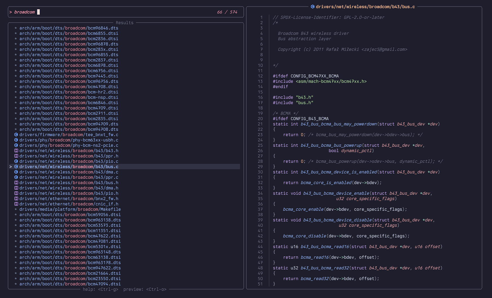
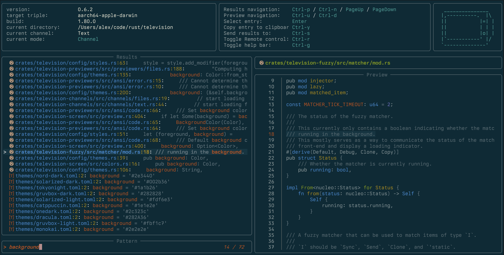

<div align="center">

# 📺  television
**Blazing fast general purpose fuzzy finder TUI.**


[](https://crates.io/crates/television)


</div>

## About
`Television` is a fast and versatile fuzzy finder TUI.

It lets you quickly search through any kind of data source (files, git repositories, environment variables, docker
images, you name it) using a fuzzy matching algorithm and is designed to be easily extensible.


It is inspired by the neovim [telescope](https://github.com/nvim-telescope/telescope.nvim) plugin and leverages [tokio](https://github.com/tokio-rs/tokio) and the *nucleo* matcher used by the [helix](https://github.com/helix-editor/helix) editor to ensure optimal performance.


## Features
- ⚡️ **High Speed**: utilizes async I/O and multithreading to maintain a smooth and responsive UI.

- 🧠 **Fuzzy Matching**: cutting-edge fuzzy matching library for efficiently filtering through lists of entries

- 🔋 **Batteries Included**: comes with a set of builtin channels and previewers that you can start using out of the box.

- 🐚 **Shell Integration**: allows you to easily integrate `television` with your shell to benefit from smart completion anywhere.

- 📺 **Channels**: designed around the concept of channels, which are a set of builtin data sources that you can search through (e.g. files, git repositories, environment variables, etc.).

- 📡 **Cable Channels**: users may add their own custom channels to tv using a simple and centralized configuration file.

- 📜 **Previewers**: allows you to preview the contents of an entry in a separate pane.

- 🖼️ **Builtin Syntax Highlighting**: comes with builtin asynchronous syntax highlighting for a wide variety of file types.

- 🎛️ **Keybindings**: includes a set of intuitive default keybindings inspired by vi and other popular terminal shortcuts.

- 🌈 **Themes**: offers a variety of themes to choose from, with the flexibility to create your own effortlessly.

- 📦 **Cross-platform**: cross-platform and works seamlessly on any system that supports Rust.

- ✅ **Terminal Emulator Compatibility**: tested with various terminal emulators and is designed to work smoothly on most of them.


## Installation
<details>  
<summary>Homebrew</summary>
    
  ```bash
  brew install television
  ```

</details>
<details>
  <summary>
    Arch Linux
  </summary>

  ```bash
  pacman -S television
  ```

</details>
<details>
  <summary>
    Debian-based (Debian, Ubuntu, Pop!_OS, Linux Mint, etc.)
  </summary>
    
  ```bash
  curl -LO https://github.com/alexpasmantier/television/releases/download/0.8.0/television_0.8.0-1_amd64.deb
  sudo dpkg -i television_0.8.0-1_amd64.deb
  ```
    
</details>
<details>
  <summary>
    Conda-forge (cross-platform)
  </summary>
  
  ```bash
  pixi global install television
  ```
</details>
<details>
  <summary>
    Binary
  </summary>
  
  From the [latest release](https://github.com/alexpasmantier/television/releases/latest) page:
  - Download the latest release asset for your platform (e.g. `tv-vX.X.X-linux-x86_64.tar.gz` if you're on a linux x86 machine)
  - Unpack and copy to the relevant location on your system (e.g. `/usr/local/bin` on macos and linux for a global installation)

</details>
<details>
  <summary>
    Cargo
  </summary>

  Setup the latest stable Rust toolchain via rustup:
  ```bash
  curl --proto '=https' --tlsv1.2 -sSf https://sh.rustup.rs | sh
  rustup update
  ```
  Install `television`:
  ```bash
  cargo install --locked television
  ```
</details>

### Shell integration

To enable shell integration, run:
```bash
echo 'eval "$(tv init zsh)"' >> ~/.zshrc
```
And then restart your shell. Hitting <kbd>Ctrl-T</kbd> in your shell will now provide you with smart completion powered
by `television`.

*Support for other shells is coming soon.*


## Usage
```bash
tv [channel] #[default: files] [possible values: env, files, git-repos, text, alias]

# e.g. to search through environment variables
tv env

# piping into tv (e.g. logs)
my_program | tv

# piping into tv with a custom preview command
fd -t f . | tv --preview 'bat -n --color=always {0}'

```
By default, `television` will launch with the `files` channel on.


 *`tv`'s `files` channel running on the *linux* codebase* 

*For more information on the different channels, see the [channels](./docs/channels.md) documentation.*


## Keybindings
Default keybindings are as follows:

| Key | Description |
| :---: | ----------- |
| <kbd>↑</kbd> / <kbd>↓</kbd> | Navigate through the list of entries |
| <kbd>Ctrl</kbd> + <kbd>u</kbd> / <kbd>d</kbd> | Scroll the preview pane up / down |
| <kbd>Enter</kbd> | Select the current entry |
| <kbd>Ctrl</kbd> + <kbd>y</kbd> | Copy the selected entry to the clipboard |
| <kbd>Ctrl</kbd> + <kbd>r</kbd> | Toggle remote control mode |
| <kbd>Ctrl</kbd> + <kbd>s</kbd> | Toggle send to channel mode |
| <kbd>Ctrl</kbd> + <kbd>g</kbd> | Toggle the help panel |
| <kbd>Esc</kbd> | Quit the application |

These keybindings are all configurable (see [Configuration](#configuration)).


## Configuration

**Default configuration: [config.toml](./.config/config.toml)**

Locations where `television` expects the configuration files to be located for each platform:

|Platform|Value|
|--------|:-----:|
|Linux|`$HOME/.config/television/config.toml`|
|macOS|`$HOME/.config/television/config.toml`|
|Windows|`{FOLDERID_LocalAppData}\television\config`|

Or, if you'd rather use the XDG Base Directory Specification, tv will look for the configuration file in
`$XDG_CONFIG_HOME/television/config.toml` if the environment variable is set.

## Themes
Builtin themes are available in the [themes](./themes) directory. Feel free to experiment and maybe even contribute your own!

|  catppuccin |  gruvbox-dark |
|:--:|:--:|
|  **solarized-dark** |  **nord** |

You may create your own custom themes by adding them to the `themes` directory in your configuration folder and then referring to them by file name (without the extension) in the configuration file.
```
config_location/
├── themes/
│   └── my_theme.toml
└── config.toml
```

## Search Patterns
`television` uses a fuzzy matching algorithm to filter the list of entries. Its behavior depends on the input pattern you provide.

| Matcher | Pattern |
| --- | :---: |
| Fuzzy | `foo` |
| Substring | `'foo` / `!foo` to negate |
| Prefix | `^foo` / `!^foo` to negate |
| Suffix | `foo$` / `!foo$` to negate |
| Exact | `^foo$` / `!^foo$` to negate |

For more information on the matcher behavior, see the
[nucleo-matcher](https://docs.rs/nucleo-matcher/latest/nucleo_matcher/pattern/enum.AtomKind.html) documentation.

## Terminal Emulators Compatibility
Here is a list of terminal emulators that have currently been tested with `television` and their compatibility status.

| Terminal Emulator | Tested Platforms | Compatibility |
| --- | :---: | :---: |
| Alacritty | macOS, Linux | ✅ |
| Kitty | macOS, Linux | ✅ |
| iTerm2 | macOS | ✅ |
| Ghostty | macOS | ✅ |
| Wezterm | macOS, Linux, Windows | ✅ |
| macOS Terminal | macOS | functional but coloring issues |
| Konsole | Linux | ✅ |
| Terminator | Linux | ✅ |
| Xterm | Linux | ✅ |
| Cmder | Windows | ✖️ |
| Foot | Linux | ✅ |
| Rio | macOS, Linux, Windows | ✅ |
| Warp | macOS | ✅ |
| Hyper | macOS | ✅ |


## Contributions

Contributions, issues and pull requests are welcome.

See [CONTRIBUTING.md](CONTRIBUTING.md) and [good first issues](https://github.com/alexpasmantier/television/issues?q=is%3Aopen+is%3Aissue+label%3A%22good+first+issue%22) for more information.
