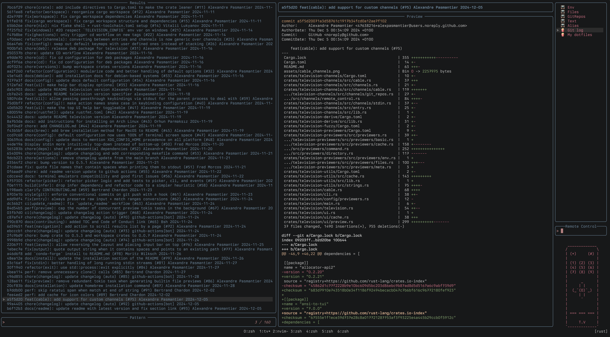

<div align="center">

# 📺  television
**A blazingly fast general purpose fuzzy finder TUI.**


[](https://crates.io/crates/television)


|  | 
|:--:| 
| *The revolution will (not) be televised.* |

</div>

## About
`Television` is a blazingly fast general purpose fuzzy finder TUI.

It is inspired by the neovim [telescope](https://github.com/nvim-telescope/telescope.nvim) plugin and is designed to be fast, efficient, simple to use and easily extensible. It is built on top of [tokio](https://github.com/tokio-rs/tokio), [ratatui](https://github.com/ratatui/ratatui) and the *nucleo* matcher used by the [helix](https://github.com/helix-editor/helix) editor.


## Installation
<details>  
<summary>Homebrew</summary>
    
  ```bash
  brew install television
  ```

</details>
<details>
  <summary>
    Arch Linux
  </summary>

  ```bash
  pacman -S television
  ```

</details>
<details>
  <summary>
    Debian-based (Debian, Ubuntu, Pop!_OS, Linux Mint, etc.)
  </summary>
    
  ```bash
  curl -LO https://github.com/alexpasmantier/television/releases/download/0.6.2/television_0.6.2-1_amd64.deb
  sudo dpkg -i television_0.6.2-1_amd64.deb
  ```
    
</details>
<details>
  <summary>
    Conda-forge (cross-platform)
  </summary>
  
  ```bash
  pixi global install television
  ```
</details>
<details>
  <summary>
    Binary
  </summary>
  
  From the [latest release](https://github.com/alexpasmantier/television/releases/latest) page:
  - Download the latest release asset for your platform (e.g. `tv-vX.X.X-linux-x86_64.tar.gz` if you're on a linux x86 machine)
  - Unpack and copy to the relevant location on your system (e.g. `/usr/local/bin` on macos and linux for a global installation)

</details>
<details>
  <summary>
    Cargo
  </summary>

  Setup the latest stable Rust toolchain via rustup:
  ```bash
  curl --proto '=https' --tlsv1.2 -sSf https://sh.rustup.rs | sh
  rustup update
  ```
  Install `television`:
  ```bash
  cargo install --locked television
  ```
</details>

## Usage
```bash
tv [channel] #[default: files] [possible values: env, files, git-repos, text, alias]

# piping into tv
ls -1a | tv

# piping into tv with a custom preview command
ls -1a | tv --preview-command 'cat {}'
```
By default, `television` will launch with the `files` channel on.
|  |
|:--:|
| *`tv`'s `files` channel running on the *curl* codebase* |

#### Matcher behavior
`television` uses a fuzzy matching algorithm to filter the list of entries. The algorithm that is used depends on the
input pattern that you provide.

| Matcher | Pattern |
| --- | :---: |
| Fuzzy | `foo` |
| Substring | `'foo` / `!foo` to negate |
| Prefix | `^foo` / `!^foo` to negate |
| Suffix | `foo$` / `!foo$` to negate |
| Exact | `^foo$` / `!^foo$` to negate |

For more information on the matcher behavior, see the
[nucleo-matcher](https://docs.rs/nucleo-matcher/latest/nucleo_matcher/pattern/enum.AtomKind.html) documentation.

## Keybindings
Default keybindings are as follows:

| Key | Description |
| :---: | ----------- |
| <kbd>↑</kbd> / <kbd>↓</kbd> | Navigate through the list of entries |
| <kbd>Ctrl</kbd> + <kbd>u</kbd> / <kbd>d</kbd> | Scroll the preview pane up / down |
| <kbd>Enter</kbd> | Select the current entry |
| <kbd>Ctrl</kbd> + <kbd>y</kbd> | Copy the selected entry to the clipboard |
| <kbd>Ctrl</kbd> + <kbd>r</kbd> | Toggle remote control mode |
| <kbd>Ctrl</kbd> + <kbd>s</kbd> | Toggle send to channel mode |
| <kbd>Ctrl</kbd> + <kbd>g</kbd> | Toggle the help panel |
| <kbd>Esc</kbd> | Quit the application |

These keybindings are all configurable (see [Configuration](#configuration)).

## 📺 Built-in Channels
The following built-in channels are currently available:
- `Files`: search through files in a directory tree.
- `Text`: search through textual content in a directory tree.
- `GitRepos`: search through git repositories anywhere on the file system.
- `Env`: search through environment variables and their values.
- `Alias`: search through shell aliases and their values.
- `Stdin`: search through lines of text from stdin.

## 🍿 Cable channels
*Tired of broadcast television? Want to watch your favorite shows on demand? `television` has you covered with cable channels. Cable channels are channels that are not built-in to `television` but are instead provided by the community.*

You can find a list of available cable channels [on the wiki](https://github.com/alexpasmantier/television/wiki/Cable-channels) and even contribute your own!

### Installing cable channels
Installing cable channels is as simple as creating provider files in your configuration folder.

A provider file is a `*channels.toml` file that contains cable channel prototypes defined as follows:

**my-custom-channels.toml**
```toml
[[cable_channel]]
name = "Git log"
source_command = 'git log --oneline --date=short --pretty="format:%h %s %an %cd" "$@"'
preview_command = 'git show -p --stat --pretty=fuller --color=always {0}'

[[cable_channel]]
name = "My dotfiles"
source_command = 'fd -t f . $HOME/.config'
preview_command = 'bat -n --color=always {0}'
```

This would add two new cable channels to `television` available using the remote control mode:



<details>

  <summary>Deciding which part of the source command output to pass to the previewer:</summary>

  By default, each line of the source command can be passed to the previewer using `{}`. 

  If you wish to pass only a part of the output to the previewer, you may do so by specifying the `preview_delimiter` to use as a separator and refering to the desired part using the corresponding index.

  **Example:**
  ```toml
  [[cable_channel]]
  name = "Disney channel"
  source_command = 'echo "one:two:three:four" && echo "five:six:seven:eight"'
  preview_command = 'echo {2}'
  preview_delimiter = ':'
  # which will pass "three" and "seven" to the preview command
  ```

</details>

## Configuration
Default (may be overriden) locations where `television` expect the configuration files to be located for each platform:

|Platform|Value|
|--------|:-----:|
|Linux|`$HOME/.config/television/config.toml`|
|macOS|`$HOME/Library/Application Support/com.television/config.toml`|
|Windows|`{FOLDERID_LocalAppData}\television\config`|

Or, if you'd rather use the XDG Base Directory Specification, tv will look for the configuration file in
`$XDG_CONFIG_HOME/television/config.toml` if the env variable is set.

**Default configuration: [config.toml](./.config/config.toml)**

## Themes
Builtin themes are available in the [themes](./themes) directory. Feel free to contribute your own themes!

You may provide your own themes by adding files to a `themes` directory in your configuration folder and then
referring to them by file name through the configuration file.
```
config_location/
├── themes/
│   └── my_theme.toml
└── config.toml
```

## Design (high-level)
#### Channels
**Television**'s design is primarily based on the concept of **Channels**.
Channels are just structs that implement the `OnAir` trait. 

As such, channels can virtually be anything that can respond to a user query and return a result under the form of a list of entries. This means channels can be anything from conventional data sources you might want to search through (like files, git repositories, remote filesystems, environment variables etc.) to more exotic implementations that might inclue a REPL, a calculator, a web browser, search through your spotify library, your email, etc.


**Television** provides a set of built-in **Channels** that can be used out of the box (see [Built-in Channels](#built-in-channels)). The list of available channels
will grow over time as new channels are implemented to satisfy different use cases. 


#### Transitions
When it makes sense, **Television** allows for transitions between different channels. For example, you might want to
start searching through git repositories, then refine your search to a specific set of files in that shortlist of
repositories and then finally search through the textual content of those files.

This can easily be achieved using transitions.

#### Previewers
Entries returned by different channels can be previewed in a separate pane. This is useful when you want to see the
contents of a file, the value of an environment variable, etc. Because entries returned by different channels may
represent different types of data, **Television** allows for channels to declare the type of previewer that should be
used. Television comes with a set of built-in previewers that can be used out of the box and will grow over time.


## Terminal Emulators Compatibility
Here is a list of terminal emulators that have currently been tested with `television` and their compatibility status.

| Terminal Emulator | Tested Platforms | Compatibility |
| --- | :---: | :---: |
| Alacritty | macOS, Linux | ✅ |
| Kitty | macOS, Linux | ✅ |
| iTerm2 | macOS | ✅ |
| Wezterm | macOS, Linux, Windows | ✅ |
| macOS Terminal | macOS | functional but coloring issues |
| Konsole | Linux | ✅ |
| Terminator | Linux | ✅ |
| Xterm | Linux | ✅ |
| Cmder | Windows | ✖️ |
| Foot | Linux | ✅ |
| Rio | macOS, Linux, Windows | ✅ |
| Warp | macOS | ✅ |
| Hyper | macOS | ✅ |


## Contributions

Contributions, issues and pull requests are welcome.

See [CONTRIBUTING.md](CONTRIBUTING.md) and [good first issues](https://github.com/alexpasmantier/television/issues?q=is%3Aopen+is%3Aissue+label%3A%22good+first+issue%22) for more information.
