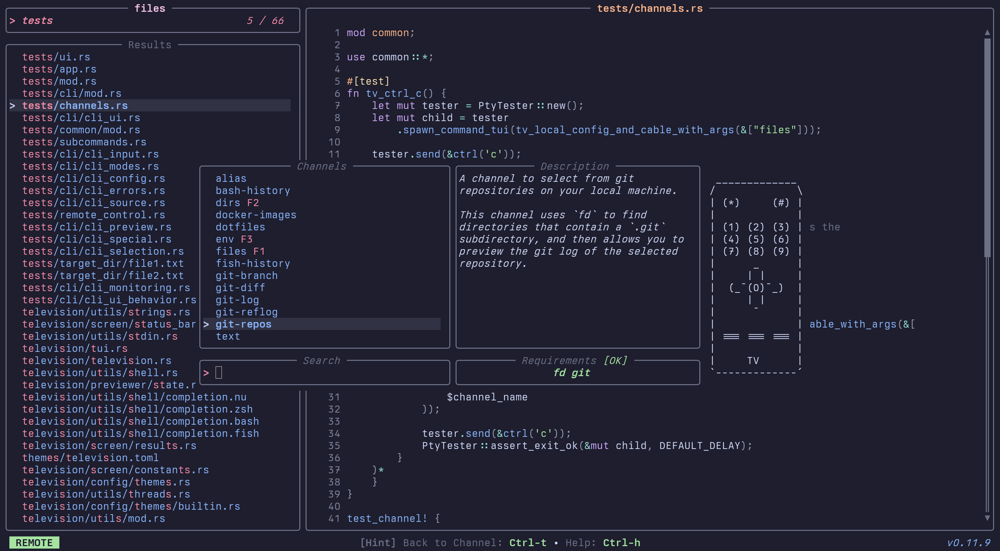

<div align="center">

  
**A cross-platform, fast and extensible general purpose fuzzy finder for the terminal.**


</div>

## About

`Television` is a cross-platform, fast and extensible fuzzy finder for the terminal.

It integrates with your shell and lets you quickly search through any kind of data source (files, git repositories, environment variables, docker
images, you name it) using a fuzzy matching algorithm and is designed to be extensible.

It is inspired by the neovim [telescope](https://github.com/nvim-telescope/telescope.nvim) plugin and leverages [tokio](https://github.com/tokio-rs/tokio) and the [nucleo](https://github.com/helix-editor/nucleo) matcher used by the [helix](https://github.com/helix-editor/helix) editor to ensure optimal performance.

## Installation

See the [installation docs](https://github.com/alexpasmantier/television/wiki/Installation).

[](https://repology.org/project/television/versions?columns=4)

Or [build from source](https://github.com/alexpasmantier/television/wiki/Installation#--building-from-source)

## Quick start

Create a channel: _~/.config/television/cable/files.toml_

```toml
[metadata]
name = "files"
description = "A channel to select files and directories"
requirements = ["fd", "bat"]

[source]
command = "fd -t f"

[preview]
command = "bat -n --color=always '{}'"
env = { BAT_THEME = "Catppuccin Mocha" }

[ui]
preview_panel = { "size" = 70, "scrollbar" = true }

[keybindings]
shortcut = "f1"
```

Start searching:

```sh
tv files
```


Switch channels using the remote control and pick from a large choice of [community-maintained channels](./cable) which
you can install with `tv update-channels`:



See the [channels docs](https://github.com/alexpasmantier/television/blob/main/docs/channels.md) for more info on how to set these up.

## Usage

```bash
tv  # default channel

tv [channel]  # e.g. `tv files`, `tv env`, `tv git-repos`, etc.

# pipe the output of your program into tv
my_program | tv

fd -t f . | tv --preview 'bat -n --color=always {}'

# or build your own channel on the fly
tv --source-command 'fd -t f .' --preview-command 'bat -n --color=always {}' --preview-size 70
```

> [!TIP]
> 🐚 _Television provides smart autocompletion based on the commands you start typing in your shell._
>
> _Take a look at [this page](https://github.com/alexpasmantier/television/wiki/Shell-Autocompletion) for how to set it up for your shell._

## Keybindings

See [keybindings](https://github.com/alexpasmantier/television/wiki/Keybindings)

## Configuration

See [configuration](https://github.com/alexpasmantier/television/wiki/Configuration-file)

## Themes

See [themes](./themes)

## Search Patterns

See [search patterns](https://github.com/alexpasmantier/television/wiki/Search-patterns)

## Contributions

Contributions, issues and pull requests are welcome.

See [CONTRIBUTING.md](CONTRIBUTING.md) and [good first issues](https://github.com/alexpasmantier/television/issues?q=is%3Aopen+is%3Aissue+label%3A%22good+first+issue%22) for more information.

## Credits

This project was inspired by the **awesome** work done by the [telescope](https://github.com/nvim-telescope/telescope.nvim) neovim plugin.

It also leverages the great [helix](https://github.com/helix-editor/helix) editor's nucleo fuzzy matching library, the [tokio](https://github.com/tokio-rs/tokio) async runtime as well as the **formidable** [ratatui](https://github.com/ratatui/ratatui) library.
