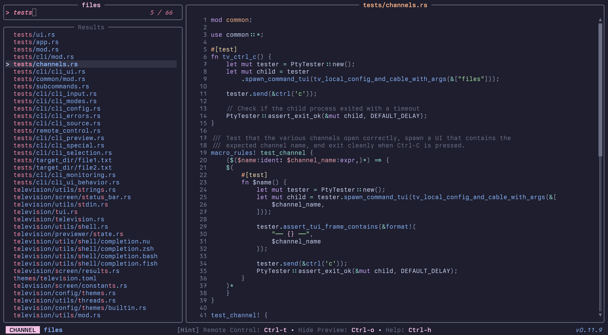

# Quickstart

Create a channel: _~/.config/television/cable/files.toml_

```toml
[metadata]
name = "files"
description = "A channel to select files and directories"
requirements = ["fd", "bat"]

[source]
command = "fd -t f"

[preview]
command = "bat -n --color=always '{}'"
env = { BAT_THEME = "Catppuccin Mocha" }

[ui]
preview_panel = { "size" = 70, "scrollbar" = true }

[keybindings]
shortcut = "f1"
```

Start searching:

```sh
tv files
```



Switch channels using the remote control and pick from a large choice of [community-maintained channels](./10-community-channels-unix.md):


See the [channels docs](./07-channels.md) for more info on how to set these up.
