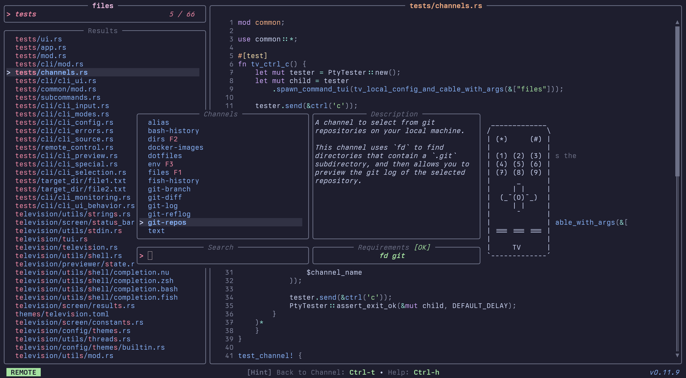

# Channels

## Quick start

Channels are short configuration recipes that typically dictate what `tv` should search through and what's displayed on the screen along with various other options.

Any given channel consists of a single TOML file.

**Example**: the default `files` channel

```toml
[metadata]
name = "files"
description = "A channel to select files and directories"
requirements = ["fd", "bat"]

[source]
command = "fd -t f"

[preview]
command = "bat -n --color=always '{}'"
env = { BAT_THEME = "ansi" }

[keybindings]
shortcut = "f1"
```

## Default location on your system

Channels live in the `cable` directory inside your [television configuration directory](./03-configuration.md).

**Example**:

```
/home/user/.config/television
├── config.toml
└── cable
    ├── files.toml
    ├── env.toml
    ├── alias.toml
    ├── git-repos.toml
    └── text.toml
```

## Community-maintained channels

The repository hosts a list of community-maintained channels which you can get and install to your cable directory using:

```sh
tv update-channels
```

## Invocation

Channels may be invoked:

1. directly from the cli:

```
tv files
```

2. using the remote control:
   

3. on the fly:

```
tv --source-command 'fd -t f .' --preview-command 'bat -n --color=always {}' --preview-size 70
```

## Creating your own channels

Create a new TOML file in your cable directory:

```sh
touch ~/.config/television/cable/my-awesome-channel.toml
```

Fill out the minimum required fields:

```toml
[metadata]
name = "my-awesome-channel"

[source]
command = "aws s3 ls my-bucket"
```

Launch `tv` with your new channel (or select it via the remote control):

```sh
tv my-awesome-channel
```

The complete channel format spec can be found below.

## Templating syntax

Several channel fields can be formatted dynamically using the syntax described in the [string-pipeline](https://docs.rs/string_pipeline/0.12.0/string_pipeline/) crate.

Here's a quick TLDR if you're feeling lazy:

**Basic transformations:**

```bash
# Extract middle items: "a,b,c,d,e"
"{split:,:1..3}"
# Output: "b,c"

# Clean and format names: "  john  , jane , bob  "
'{split:,:..|map:{trim|upper|append:!}}'
# Output: "JOHN!,JANE!,BOB!"

# Extract numbers and pad with zeros: "item1,thing22,stuff333"
'{split:,:..|map:{regex_extract:\d+|pad:3:0:left}}'
# Output: "001,022,333"
```

**More niche use-cases:**

```bash
# Filter files, format as list: "app.py,readme.md,test.py,data.json"
'{split:,:..|filter:\.py$|sort|map:{prepend:• }|join:\n}'
# Output: "• app.py\n• test.py"

# Extract domains from URLs: "https://github.com,https://google.com"
'{split:,:..|map:{regex_extract://([^/]+):1|upper}}'
# Output: "GITHUB.COM,GOOGLE.COM"

# Debug complex processing: "apple Banana cherry Date"
"{split: :..|filter:^[A-Z]|sort:desc}"
# Output: Date,Banana
```

## Channel specification

#### high-level sections

```toml
[metadata]
# general channel information

[source]
# this defines what we're searching through

[preview]
# for each result, maybe display a preview

[ui]
# customize the UI

[keybindings]
# customize keybindings
```

#### `[metadata]`

```toml
[metadata]
name = "text"
description = "A short description about what my channel does"
requirements = ["rg", "bat"]  # any binary requirements my channel needs
```

#### `[source]`

```toml
[source]
command = "rg . --no-heading --line-number"
display = "[{split:\\::..2}]\t{split:\\::2}"  # what's displayed in the UI
output = "{split:\\::..2}"  # what's outputed on selection
ansi = true  # whether the results are ANSI formatted
```

#### `[preview]`

```toml
[preview]
command = 'bat -n --color=always {split:\::0}'
env = { BAT_THEME = "ansi" }  # extra envs to use when generating preview
offset = '{split:\::1}'  # extracts preview offset information from the entry
```

#### `[ui]`

```toml
[ui]
ui_scale = 80  # use 80% of available screen
layout = "portrait"
input_bar_position = "bottom"
input_header = "Search:"

[ui.preview_panel]
size = 40  # 40%
header = "{}"  # show the currently selected entry
footer = "my awesome footer"
scrollbar = false

[ui.status_bar]
separator_open = "<"
separator_close = ">"

[ui.help_panel]
show_categories = true

[ui.remote_control]
show_channel_descriptions = true
sort_alphabetically = true

# UI panel visibility (individual control)
[ui.preview_panel]
hidden = false

[ui.status_bar]
hidden = false

[ui.help_panel]
hidden = true

[ui.remote_control]
# disabled = false  # uncomment to disable remote control for this channel
```

#### `[keybindings]`

```toml
[keybindings]
shortcut = "f1"  # `f1` will automatically switch to this channel

quit = ["esc", "ctrl-c"]
select_next_entry = "ctrl-j"
select_prev_entry = "ctrl-k"
confirm_selection = "ctrl-y"
```

See [actions.rs](https://github.com/alexpasmantier/television/blob/main/television/action.rs) for a list of available actions.

#### `[actions]`

External actions allow you to define custom commands that can be executed on
selected entries. Actions are triggered via keybindings using the
`actions:<action_name>` syntax.

**Simple Braces Syntactic Sugar:**

For most use cases, you can use simple `{}` braces which automatically handle
quoting and multiple entries:

```toml
[actions.edit]
description = "Open selected files in editor"
command = "nvim {}"
# Single file: nvim 'file1.txt'
# Multiple files: nvim 'file1.txt' 'file2.txt'
# Files with quotes: nvim 'file\'s name.txt'
```

**Advanced Template Processing:**

For complex formatting needs, use the full [templating syntax](#templating-syntax):

```toml
[keybindings]
ctrl-e = "actions:edit"
f2 = "actions:view"

[actions.edit]
description = "Open selected files in editor"
command = "nvim {split:\\n:..|map:{append:'|prepend:'}|join: }"
mode = "execute"
separator = "\n"
# example: inputs "file1" and "file 2" will generate the command
# nvim 'file1' 'file 2'
# Note: we added quotes at command level to avoid shell artifacts

[actions.view]
description = "View files with less"
command = "less {}"
mode = "fork"
separator = " "
# example: inputs "file1" and "file 2" will generate the command
# less file1 file 2
# Note: 3 args here, instead of 2
```

**Action specification:**

- `description` - Optional description of what the action does
- `command` - Command template to execute (supports [templating syntax](#templating-syntax))
- `mode` - Execution mode:
  - `execute` - Run command and become the new process
  - `fork` - Run command in a subprocess, allowing you to return to tv upon completion
- `separator` - Character(s) to use when joining **multiple selected entries** when using complex template processing,
depending on the entries content it might be beneficial to change to another
one (default: `" "` - space)
