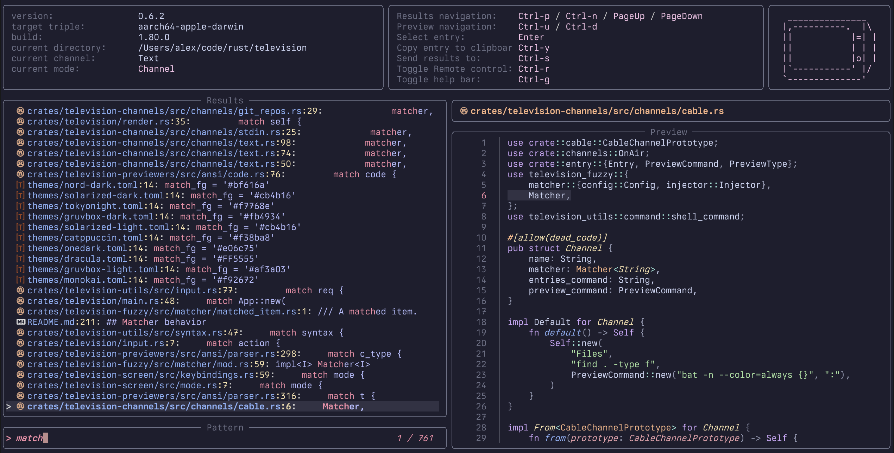
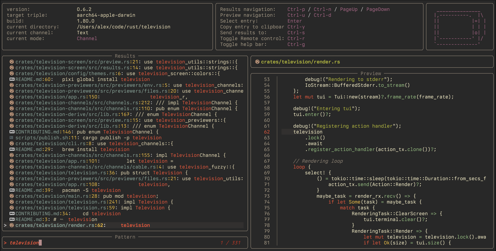
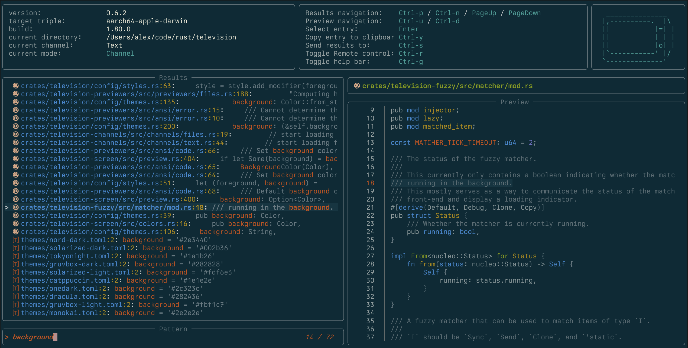
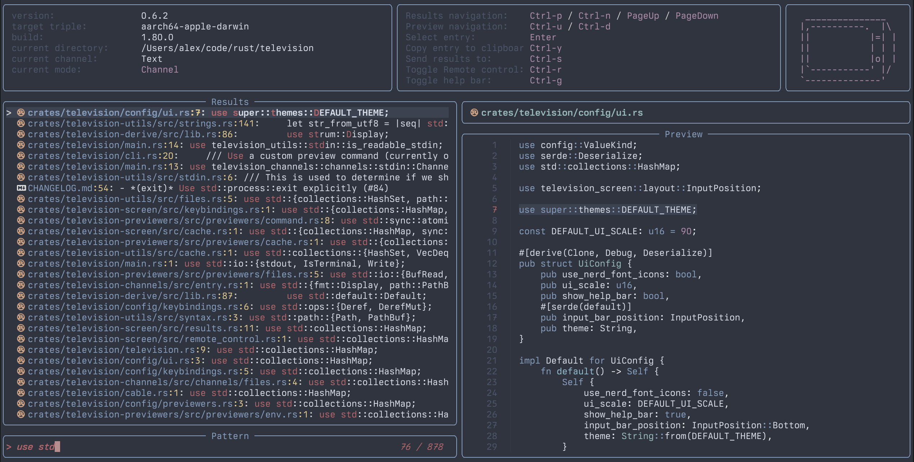

# Themes

Builtin themes are available in the [themes](https://github.com/alexpasmantier/television/tree/main/themes) directory. Feel free to experiment and maybe even contribute your own!

|           catppuccin           |  gruvbox-dark |
| :-----------------------------------------------------------------------------------: | :---------------------------------------------------------: |
|  **solarized-dark** |        **nord**        |

## Custom Themes

You may create your own custom themes by adding them to the `themes` directory in your configuration folder and then referring to them by file name (without the extension) in the configuration file.

```
config_location/
├── themes/
│   └── my_theme.toml
└── config.toml
```

_my_theme.toml_

```toml
# general
background = '#1e1e2e'
border_fg = '#6c7086'
text_fg = '#cdd6f4'
dimmed_text_fg = '#6c7086'
# input
input_text_fg = '#f38ba8'
result_count_fg = '#f38ba8'
# results
result_name_fg = '#89b4fa'
result_line_number_fg = '#f9e2af'
result_value_fg = '#b4befe'
selection_fg = '#a6e3a1'
selection_bg = '#313244'
match_fg = '#f38ba8'
# preview
preview_title_fg = '#fab387'
# modes
channel_mode_fg = '#1e1e2e'
channel_mode_bg = '#f5c2e7'
remote_control_mode_fg = '#1e1e2e'
remote_control_mode_bg = '#a6e3a1'
send_to_channel_mode_fg = '#89dceb'
```

## Theme Color Overrides

Override specific colors from any theme directly in your configuration:

```toml
[ui]
theme = "gruvbox-dark"

[ui.theme_overrides]
background = "#000000"
text_fg = "#ffffff"
selection_bg = "#444444"
match_fg = "#ff0000"
```

### Properties

**General:** `background`, `border_fg`, `text_fg`, `dimmed_text_fg`  
**Input:** `input_text_fg`, `result_count_fg`  
**Results:** `result_name_fg`, `result_line_number_fg`, `result_value_fg`, `selection_bg`, `selection_fg`, `match_fg`  
**Preview:** `preview_title_fg`  
**Modes:** `channel_mode_fg`, `channel_mode_bg`, `remote_control_mode_fg`, `remote_control_mode_bg`

### Colors

ANSI: `"red"`, `"bright-blue"`, `"white"`  
Hex: `"#ff0000"`, `"#1e1e2e"`
