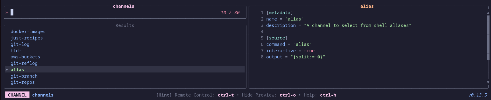
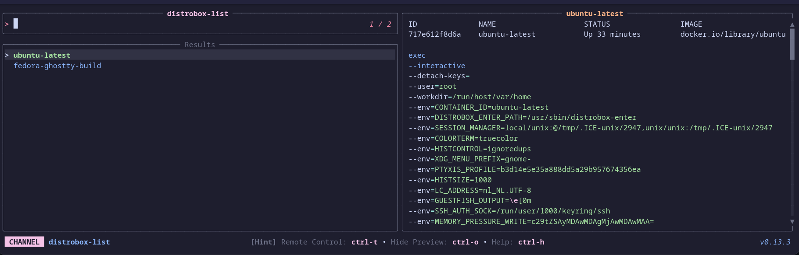
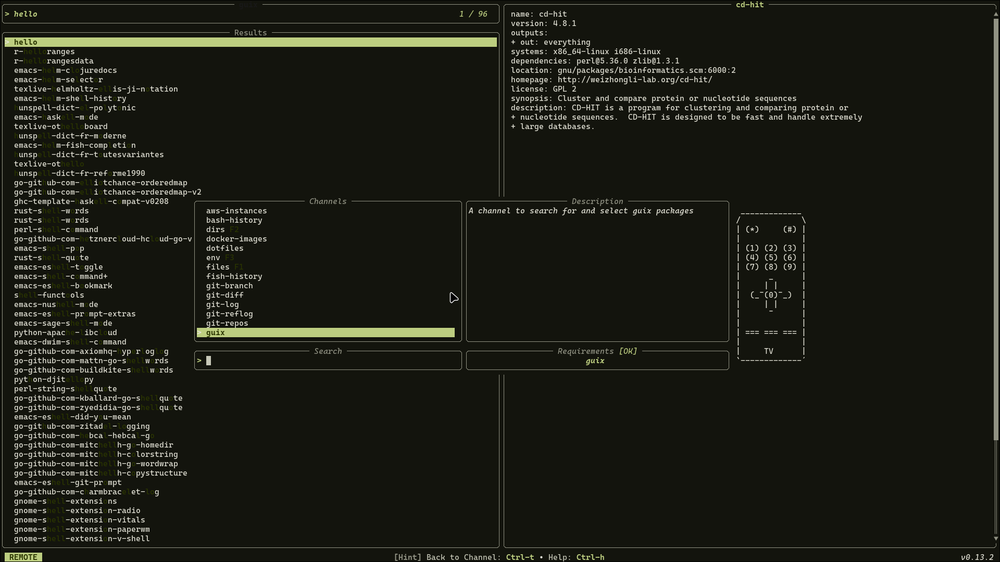
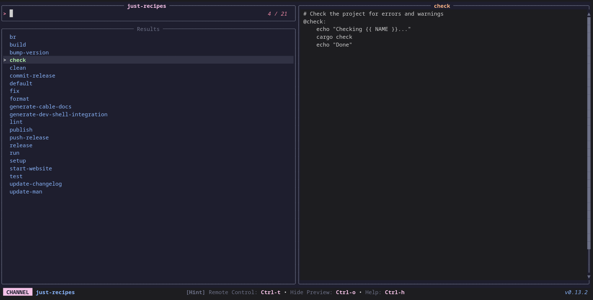
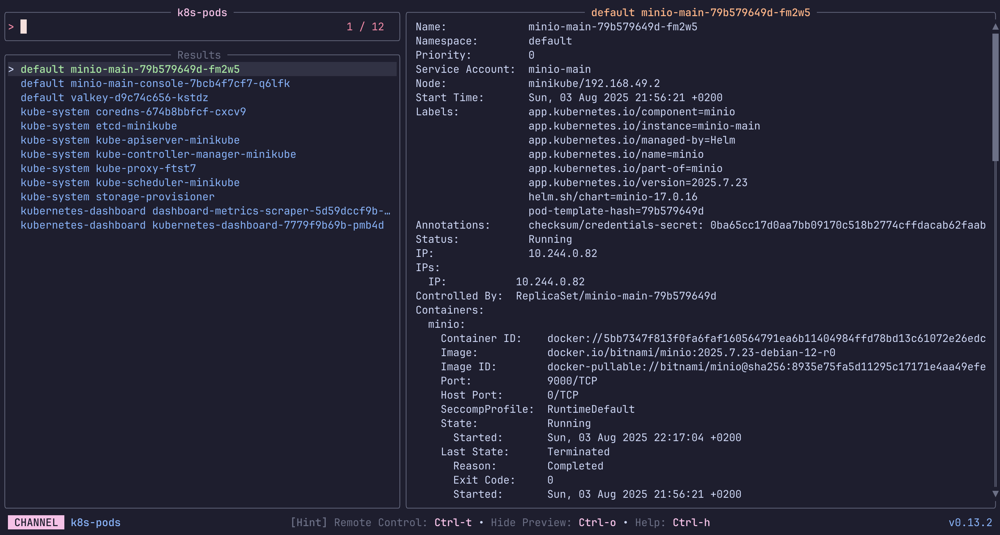
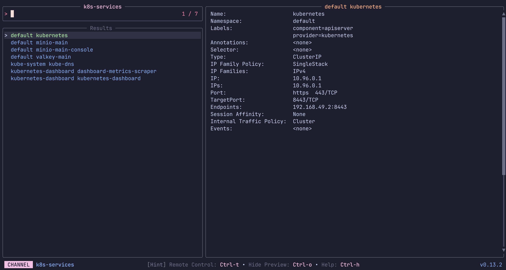
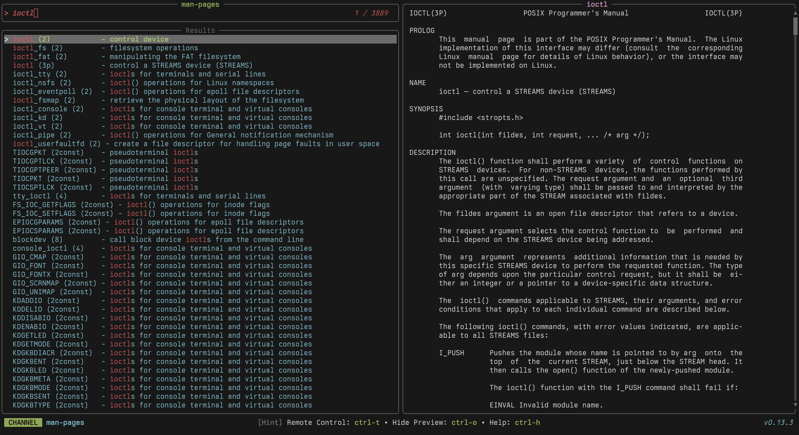
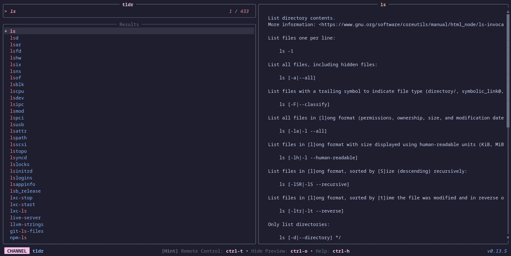

# Community Channels (unix)

### *alias*

A channel to select from shell aliases

**Requirements:** *None*

**Code:** *alias.toml*

```toml
[metadata]
name = "alias"
description = "A channel to select from shell aliases"

[source]
command = "alias"
interactive = true
output = "{split:=:0}"

```


---

### *aws-buckets*

List and preview AWS S3 Buckets


**Requirements:** `aws`

**Code:** *aws-buckets.toml*

```toml
[metadata]
name = "aws-buckets"
description = "List and preview AWS S3 Buckets"
requirements = [ "aws",]

[source]
command = "aws s3 ls --output text"
output = "{split: :3|trim}"

[preview]
command = "aws s3 ls s3://{split: :3|trim} --human-readable --summarize"

[ui.preview_panel]
size = 60

```


---

### *aws-instances*

List and preview AWS EC2 Instances

**Requirements:** `aws`

**Code:** *aws-instances.toml*

```toml
[metadata]
name = "aws-instances"
description = "List and preview AWS EC2 Instances"
requirements = [ "aws",]

[source]
command = "aws ec2 describe-instances --output text --query \"Reservations[*].Instances[*].[InstanceId,Tags[?Key=='Name']|[0].Value]\""

[preview]
command = "aws ec2 describe-instances --output json --instance-ids {split:\t:0} --query 'Reservations[*].Instances[0]'"

[ui.preview_panel]
size = 60

```


---

### *bash-history*

A channel to select from your bash history

**Requirements:** `bash`

**Code:** *bash-history.toml*

```toml
[metadata]
name = "bash-history"
description = "A channel to select from your bash history"
requirements = [ "bash",]

[source]
command = "sed '1!G;h;$!d' ${HISTFILE:-${HOME}/.bash_history}"

```


---

### *channels*

Select a television channel


**Requirements:** `tv`, `bat`

**Code:** *channels.toml*

```toml
[metadata]
name = "channels"
description = "Select a television channel"
requirements = [ "tv", "bat",]

[source]
command = [ "tv list-channels",]

[preview]
command = "bat -pn --color always ${XDG_CONFIG_HOME:-$HOME/.config}/television/cable/{}.toml"

[keybindings]
enter = "actions:channel-enter"

[actions.channel-enter]
description = "Enter a television channel"
command = "tv {}"
mode = "execute"

```


---

### *dirs*

A channel to select from directories

**Requirements:** `fd`

**Code:** *dirs.toml*

```toml
[metadata]
name = "dirs"
description = "A channel to select from directories"
requirements = [ "fd",]

[source]
command = [ "fd -t d", "fd -t d --hidden",]

[preview]
command = "ls -la --color=always '{}'"

[keybindings]
shortcut = "f2"

```


---

### *distrobox-list*

A channel to select a container from distrobox


**Requirements:** `distrobox`, `bat`

**Code:** *distrobox-list.toml*

```toml
[metadata]
name = "distrobox-list"
description = "A channel to select a container from distrobox"
requirements = [ "distrobox", "bat",]

[source]
command = [ "distrobox list | awk -F '|' '{ gsub(/ /, \"\", $2); print $2}' | tail --lines=+2",]

[preview]
command = "(distrobox list | column -t -s '|' | awk -v selected_name={} 'NR==1 || $0 ~ selected_name') && echo && distrobox enter -d {} | bat --plain --color=always -lbash"

[keybindings]
ctrl-e = "actions:distrobox-enter"
ctrl-l = "actions:distrobox-list"
ctrl-r = "actions:distrobox-rm"
ctrl-s = "actions:distrobox-stop"
ctrl-u = "actions:distrobox-upgrade"

[actions.distrobox-enter]
description = "Enter a distrobox"
command = "distrobox enter {}"
mode = "execute"

[actions.distrobox-list]
description = "List a distrobox"
command = "distrobox list | column -t -s '|' | awk -v selected_name={} 'NR==1 || $0 ~ selected_name'"
mode = "execute"

[actions.distrobox-rm]
description = "Remove a distrobox"
command = "distrobox rm {}"
mode = "execute"

[actions.distrobox-stop]
description = "Stop a distrobox"
command = "distrobox stop {}"
mode = "execute"

[actions.distrobox-upgrade]
description = "Upgrade a distrobox"
command = "distrobox upgrade {}"
mode = "execute"

```


---

### *docker-images*

A channel to select from Docker images

**Requirements:** `docker`, `jq`

**Code:** *docker-images.toml*

```toml
[metadata]
name = "docker-images"
description = "A channel to select from Docker images"
requirements = [ "docker", "jq",]

[source]
command = "docker images --format '{{.Repository}}:{{.Tag}} {{.ID}}'"
output = "{split: :-1}"

[preview]
command = "docker image inspect '{split: :-1}' | jq -C"

```


---

### *dotfiles*

A channel to select from your user's dotfiles

**Requirements:** `fd`, `bat`

**Code:** *dotfiles.toml*

```toml
[metadata]
name = "dotfiles"
description = "A channel to select from your user's dotfiles"
requirements = [ "fd", "bat",]

[source]
command = "fd -t f . $HOME/.config"

[preview]
command = "bat -n --color=always '{}'"

```


---

### *env*

A channel to select from environment variables

**Requirements:** *None*

**Code:** *env.toml*

```toml
[metadata]
name = "env"
description = "A channel to select from environment variables"

[source]
command = "printenv"
output = "{split:=:1..}"

[preview]
command = "echo '{split:=:1..}'"

[ui]
layout = "portrait"

[keybindings]
shortcut = "f3"

[ui.preview_panel]
size = 20
header = "{split:=:0}"

```


---

### *files*

A channel to select files and directories

**Requirements:** `fd`, `bat`

**Code:** *files.toml*

```toml
[metadata]
name = "files"
description = "A channel to select files and directories"
requirements = [ "fd", "bat",]

[source]
command = [ "fd -t f", "fd -t f -H",]

[preview]
command = "bat -n --color=always '{}'"

[keybindings]
shortcut = "f1"
f12 = "actions:edit"

[preview.env]
BAT_THEME = "ansi"

[actions.edit]
description = "Opens the selected entries with the default editor (falls back to vim)"
command = "${EDITOR:-vim} '{}'"
mode = "execute"

```


---

### *fish-history*

A channel to select from your fish history

**Requirements:** `fish`

**Code:** *fish-history.toml*

```toml
[metadata]
name = "fish-history"
description = "A channel to select from your fish history"
requirements = [ "fish",]

[source]
command = "fish -c 'history'"

```


---

### *git-branch*

A channel to select from git branches

**Requirements:** `git`

**Code:** *git-branch.toml*

```toml
[metadata]
name = "git-branch"
description = "A channel to select from git branches"
requirements = [ "git",]

[source]
command = "git --no-pager branch --all --format=\"%(refname:short)\""
output = "{split: :0}"

[preview]
command = "git show -p --stat --pretty=fuller --color=always '{0}'"

```


---

### *git-diff*

A channel to select files from git diff commands

**Requirements:** `git`

**Code:** *git-diff.toml*

```toml
[metadata]
name = "git-diff"
description = "A channel to select files from git diff commands"
requirements = [ "git",]

[source]
command = "git diff --name-only HEAD"

[preview]
command = "git diff HEAD --color=always -- '{}'"

```


---

### *git-log*

A channel to select from git log entries

**Requirements:** `git`

**Code:** *git-log.toml*

```toml
[metadata]
name = "git-log"
description = "A channel to select from git log entries"
requirements = [ "git",]

[source]
command = "git log --graph --pretty=format:'%C(yellow)%h%Creset -%C(yellow)%d%Creset %s %Cgreen(%cr) %C(bold blue)<%an>%Creset' --abbrev-commit --color=always"
output = "{strip_ansi|split: :1}"
ansi = true

[preview]
command = "git show -p --stat --pretty=fuller --color=always '{strip_ansi|split: :1}' | head -n 1000"

```


---

### *git-reflog*

A channel to select from git reflog entries

**Requirements:** `git`

**Code:** *git-reflog.toml*

```toml
[metadata]
name = "git-reflog"
description = "A channel to select from git reflog entries"
requirements = [ "git",]

[source]
command = "git reflog --decorate --color=always"
output = "{0|strip_ansi}"
ansi = true

[preview]
command = "git show -p --stat --pretty=fuller --color=always '{0|strip_ansi}'"

```


---

### *git-repos*

A channel to select from git repositories on your local machine.

This channel uses `fd` to find directories that contain a `.git` subdirectory, and then allows you to preview the git log of the selected repository.


**Requirements:** `fd`, `git`

**Code:** *git-repos.toml*

```toml
[metadata]
name = "git-repos"
requirements = [ "fd", "git",]
description = "A channel to select from git repositories on your local machine.\n\nThis channel uses `fd` to find directories that contain a `.git` subdirectory, and then allows you to preview the git log of the selected repository.\n"

[source]
command = "fd -g .git -HL -t d -d 10 --prune ~ -E 'Library' -E 'Application Support' --exec dirname '{}'"
display = "{split:/:-1}"

[preview]
command = "cd '{}'; git log -n 200 --pretty=medium --all --graph --color"

```


---

### *guix*

A channel to search for and select Guix packages


**Requirements:** `guix`

**Code:** *guix.toml*

```toml
[metadata]
name = "guix"
description = "A channel to search for and select Guix packages"
requirements = [ "guix",]

[source]
command = [ "guix package --list-available=.*",]
display = "{trim|replace:s/\\s+/ /g|split: :0}"
output = "{trim|replace:s/\\s+/ /g|split: :0}"

[preview]
command = "guix package --show={trim|replace:s/\\s+/ /g|split: :0}"

[keybindings]
f12 = "actions:shell"

[actions.shell]
description = "Spawns a shell with the selected package"
command = "guix shell {trim|replace:s/\\s+/ /g|split: :0}"
mode = "execute"

```


---

### *just-recipes*

A channel to select recipes from Justfiles


**Requirements:** `just`

**Code:** *just-recipes.toml*

```toml
[metadata]
name = "just-recipes"
description = "A channel to select recipes from Justfiles"
requirements = [ "just",]

[source]
command = [ "just --summary | tr '[:blank:]' '\n'",]

[preview]
command = "just -s {}"

[keybindings]
ctrl-x = "actions:execute-recipe"

[actions.execute-recipe]
description = "Execute a justfile recipe"
command = "just {}"
mode = "execute"

```


---

### *k8s-deployments*

List and preview Deployments in a Kubernetes Cluster.

The first source lists only from the current namespace, while the second lists from all.

Keybindings

Press `ctrl-d` to delete the selected Deployment.


**Requirements:** `kubectl`

**Code:** *k8s-deployments.toml*

```toml
[metadata]
name = "k8s-deployments"
description = "List and preview Deployments in a Kubernetes Cluster.\n\nThe first source lists only from the current namespace, while the second lists from all.\n\nKeybindings\n\nPress `ctrl-d` to delete the selected Deployment.\n"
requirements = [ "kubectl",]

[source]
command = [ "  kubectl get deployments -o go-template --template '{{range .items}}{{.metadata.namespace}} {{.metadata.name}}{{\"\\n\"}}{{end}}'\n  ", "  kubectl get deployments -o go-template --template '{{range .items}}{{.metadata.namespace}} {{.metadata.name}}{{\"\\n\"}}{{end}}' --all-namespaces\n  ",]
output = "{1}"

[preview]
command = "kubectl describe -n {0} deployments/{1}"

[keybindings]
ctrl-d = "actions:delete"

[ui.preview_panel]
size = 60

[actions.delete]
description = "Delete the selected Deployment"
command = "kubectl delete -n {0} deployments/{1}"
mode = "execute"

```


---

### *k8s-pods*

List and preview Pods in a Kubernetes Cluster.

The first source lists only from the current namespace, while the second lists from all.

Keybindings

Press `ctrl-e` to execute shell inside the selected Pod.
Press `ctrl-d` to delete the selected Pod.
Press `ctrl-l` to print and follow the logs of the selected Pod.



**Requirements:** `kubectl`

**Code:** *k8s-pods.toml*

```toml
[metadata]
name = "k8s-pods"
description = "List and preview Pods in a Kubernetes Cluster.\n\nThe first source lists only from the current namespace, while the second lists from all.\n\nKeybindings\n\nPress `ctrl-e` to execute shell inside the selected Pod.\nPress `ctrl-d` to delete the selected Pod.\nPress `ctrl-l` to print and follow the logs of the selected Pod.\n"
requirements = [ "kubectl",]

[source]
command = [ "  kubectl get pods -o go-template --template '{{range .items}}{{.metadata.namespace}} {{.metadata.name}}{{\"\\n\"}}{{end}}'\n  ", "  kubectl get pods -o go-template --template '{{range .items}}{{.metadata.namespace}} {{.metadata.name}}{{\"\\n\"}}{{end}}' --all-namespaces\n  ",]
output = "{1}"

[preview]
command = "kubectl describe -n {0} pods/{1}"

[keybindings]
ctrl-d = "actions:delete"
ctrl-e = "actions:exec"
ctrl-l = "actions:logs"

[ui.preview_panel]
size = 60

[actions.exec]
description = "Execute shell inside the selected Pod"
command = "kubectl exec -i -t -n {0} pods/{1} -- /bin/sh"
mode = "execute"

[actions.delete]
description = "Delete the selected Pod"
command = "kubectl delete -n {0} pods/{1}"
mode = "execute"

[actions.logs]
description = "Follow logs of the selected Pod"
command = "kubectl logs -f -n {0} pods/{1}"
mode = "execute"

```


---

### *k8s-services*

List and preview Services in a Kubernetes Cluster.

The first source lists only from the current namespace, while the second lists from all.

keybindings

Press `ctrl-d` to delete the selected Service.



**Requirements:** `kubectl`

**Code:** *k8s-services.toml*

```toml
[metadata]
name = "k8s-services"
description = "List and preview Services in a Kubernetes Cluster.\n\nThe first source lists only from the current namespace, while the second lists from all.\n\nkeybindings\n\nPress `ctrl-d` to delete the selected Service.\n"
requirements = [ "kubectl",]

[source]
command = [ "  kubectl get services -o go-template --template '{{range .items}}{{.metadata.namespace}} {{.metadata.name}}{{\"\\n\"}}{{end}}'\n  ", "  kubectl get services -o go-template --template '{{range .items}}{{.metadata.namespace}} {{.metadata.name}}{{\"\\n\"}}{{end}}' --all-namespaces\n  ",]
output = "{1}"

[preview]
command = "kubectl describe -n {0} services/{1}"

[keybindings]
ctrl-d = "actions:delete"

[ui.preview_panel]
size = 60

[actions.delete]
description = "Delete the selected Service"
command = "kubectl delete -n {0} services/{1}"
mode = "execute"

```


---

### *man-pages*

Browse and preview system manual pages


**Requirements:** `apropos`, `man`, `col`

**Code:** *man-pages.toml*

```toml
[metadata]
name = "man-pages"
description = "Browse and preview system manual pages"
requirements = [ "apropos", "man", "col",]

[source]
command = "apropos ."

[preview]
command = "man '{0}' | col -bx"

[keybindings]
enter = "actions:open"

[preview.env]
MANWIDTH = "80"

[actions.open]
description = "Open the selected man page in the system pager"
command = "man '{0}'"
mode = "execute"

[ui.preview_panel]
header = "{0}"

```


---

### *nu-history*

A channel to select from your nu history

**Requirements:** *None*

**Code:** *nu-history.toml*

```toml
[metadata]
name = "nu-history"
description = "A channel to select from your nu history"

[source]
command = "nu -c 'open $nu.history-path | lines | uniq | reverse | to text'"

```


---

### *procs*

A channel to find and manage running processes

**Requirements:** `ps`, `awk`

**Code:** *procs.toml*

```toml
[metadata]
name = "procs"
description = "A channel to find and manage running processes"
requirements = [ "ps", "awk",]

[source]
command = "ps -e -o pid=,ucomm= | awk '{print $1, $2}'"
display = "{split: :1}"
output = "{split: :0}"

[preview]
command = "ps -p '{split: :0}' -o user,pid,ppid,state,%cpu,%mem,command | fold"

[keybindings]
ctrl-k = "actions:kill"

[actions.kill]
description = "Kill the selected process (SIGKILL)"
command = "kill -9 {split: :0}"
mode = "execute"

```


---

### *text*

A channel to find and select text from files

**Requirements:** `rg`, `bat`

**Code:** *text.toml*

```toml
[metadata]
name = "text"
description = "A channel to find and select text from files"
requirements = [ "rg", "bat",]

[source]
command = "rg . --no-heading --line-number --colors 'match:fg:white' --colors 'path:fg:blue' --color=always"
ansi = true
output = "{strip_ansi|split:\\::..2}"

[preview]
command = "bat -n --color=always '{strip_ansi|split:\\::0}'"
offset = "{strip_ansi|split:\\::1}"

[preview.env]
BAT_THEME = "ansi"

[ui.preview_panel]
header = "{strip_ansi|split:\\::..2}"

```


---

### *tldr*

Browse and preview TLDR help pages for command-line tools


**Requirements:** `tldr`

**Code:** *tldr.toml*

```toml
[metadata]
name = "tldr"
description = "Browse and preview TLDR help pages for command-line tools"
requirements = [ "tldr",]

[source]
command = "tldr --list"

[preview]
command = "tldr '{0}'"

[keybindings]
ctrl-e = "actions:open"

[actions.open]
description = "Open the selected TLDR page"
command = "tldr '{0}'"
mode = "execute"

```


---

### *zsh-history*

A channel to select from your zsh history

**Requirements:** `zsh`

**Code:** *zsh-history.toml*

```toml
[metadata]
name = "zsh-history"
description = "A channel to select from your zsh history"
requirements = [ "zsh",]

[source]
command = "sed '1!G;h;$!d' ${HISTFILE:-${HOME}/.zsh_history}"
display = "{split:;:1..}"
output = "{split:;:1..}"

```


---
