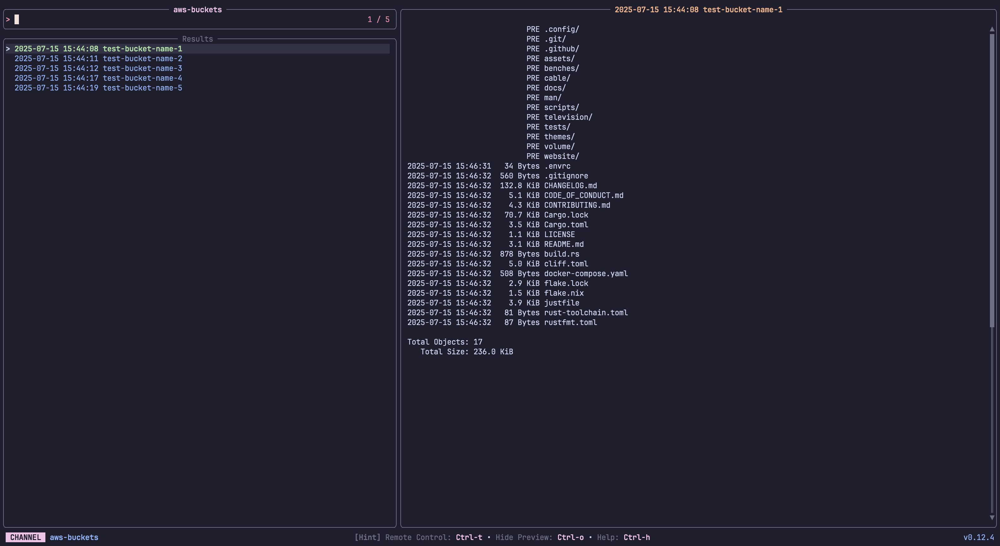

# Community Channels (unix)

### *alias*

A channel to select from shell aliases

**Requirements:** *None*

**Code:** *alias.toml*

```toml
[metadata]
name = "alias"
description = "A channel to select from shell aliases"

[source]
command = "alias"
interactive = true
output = "{split:=:0}"

```


---

### *aws-buckets*

List and preview AWS S3 Buckets


**Requirements:** `aws`

**Code:** *aws-buckets.toml*

```toml
[metadata]
name = "aws-buckets"
description = "List and preview AWS S3 Buckets"
requirements = [ "aws",]

[source]
command = "aws s3 ls --output text"
output = "{split: :3|trim}"

[preview]
command = "aws s3 ls s3://{split: :3|trim} --human-readable --summarize"

[ui.preview_panel]
size = 60

```


---

### *aws-instances*

List and preview AWS EC2 Instances

**Requirements:** `aws`

**Code:** *aws-instances.toml*

```toml
[metadata]
name = "aws-instances"
description = "List and preview AWS EC2 Instances"
requirements = [ "aws",]

[source]
command = "aws ec2 describe-instances --output text --query \"Reservations[*].Instances[*].[InstanceId,Tags[?Key=='Name']|[0].Value]\""

[preview]
command = "aws ec2 describe-instances --output json --instance-ids {split:\t:0} --query 'Reservations[*].Instances[0]'"

[ui.preview_panel]
size = 60

```


---

### *bash-history*

A channel to select from your bash history

**Requirements:** `bash`

**Code:** *bash-history.toml*

```toml
[metadata]
name = "bash-history"
description = "A channel to select from your bash history"
requirements = [ "bash",]

[source]
command = "sed '1!G;h;$!d' ${HISTFILE:-${HOME}/.bash_history}"

```


---

### *dirs*

A channel to select from directories

**Requirements:** `fd`

**Code:** *dirs.toml*

```toml
[metadata]
name = "dirs"
description = "A channel to select from directories"
requirements = [ "fd",]

[source]
command = [ "fd -t d", "fd -t d --hidden",]

[preview]
command = "ls -la --color=always '{}'"

[keybindings]
shortcut = "f2"

```


---

### *docker-images*

A channel to select from Docker images

**Requirements:** `docker`, `jq`

**Code:** *docker-images.toml*

```toml
[metadata]
name = "docker-images"
description = "A channel to select from Docker images"
requirements = [ "docker", "jq",]

[source]
command = "docker images --format '{{.Repository}}:{{.Tag}} {{.ID}}'"
output = "{split: :-1}"

[preview]
command = "docker image inspect '{split: :-1}' | jq -C"

```


---

### *dotfiles*

A channel to select from your user's dotfiles

**Requirements:** `fd`, `bat`

**Code:** *dotfiles.toml*

```toml
[metadata]
name = "dotfiles"
description = "A channel to select from your user's dotfiles"
requirements = [ "fd", "bat",]

[source]
command = "fd -t f . $HOME/.config"

[preview]
command = "bat -n --color=always '{}'"

```


---

### *env*

A channel to select from environment variables

**Requirements:** *None*

**Code:** *env.toml*

```toml
[metadata]
name = "env"
description = "A channel to select from environment variables"

[source]
command = "printenv"
output = "{split:=:1..}"

[preview]
command = "echo '{split:=:1..}'"

[ui]
layout = "portrait"

[keybindings]
shortcut = "f3"

[ui.preview_panel]
size = 20
header = "{split:=:0}"

```


---

### *files*

A channel to select files and directories

**Requirements:** `fd`, `bat`

**Code:** *files.toml*

```toml
[metadata]
name = "files"
description = "A channel to select files and directories"
requirements = [ "fd", "bat",]

[source]
command = [ "fd -t f", "fd -t f -H",]

[preview]
command = "bat -n --color=always '{}'"

[keybindings]
shortcut = "f1"

[preview.env]
BAT_THEME = "ansi"

```


---

### *fish-history*

A channel to select from your fish history

**Requirements:** `fish`

**Code:** *fish-history.toml*

```toml
[metadata]
name = "fish-history"
description = "A channel to select from your fish history"
requirements = [ "fish",]

[source]
command = "fish -c 'history'"

```


---

### *git-branch*

A channel to select from git branches

**Requirements:** `git`

**Code:** *git-branch.toml*

```toml
[metadata]
name = "git-branch"
description = "A channel to select from git branches"
requirements = [ "git",]

[source]
command = "git --no-pager branch --all --format=\"%(refname:short)\""
output = "{split: :0}"

[preview]
command = "git show -p --stat --pretty=fuller --color=always '{0}'"

```


---

### *git-diff*

A channel to select files from git diff commands

**Requirements:** `git`

**Code:** *git-diff.toml*

```toml
[metadata]
name = "git-diff"
description = "A channel to select files from git diff commands"
requirements = [ "git",]

[source]
command = "git diff --name-only HEAD"

[preview]
command = "git diff HEAD --color=always -- '{}'"

```


---

### *git-log*

A channel to select from git log entries

**Requirements:** `git`

**Code:** *git-log.toml*

```toml
[metadata]
name = "git-log"
description = "A channel to select from git log entries"
requirements = [ "git",]

[source]
command = "git log --oneline --date=short --pretty=\"format:%h %s %an %cd\" \"$@\""
output = "{split: :0}"

[preview]
command = "git show -p --stat --pretty=fuller --color=always '{0}'"

```


---

### *git-reflog*

A channel to select from git reflog entries

**Requirements:** `git`

**Code:** *git-reflog.toml*

```toml
[metadata]
name = "git-reflog"
description = "A channel to select from git reflog entries"
requirements = [ "git",]

[source]
command = "git reflog --decorate --color=always"
output = "{strip_ansi|split: :0}"
ansi = true

[preview]
command = "git show -p --stat --pretty=fuller --color=always '{strip_ansi|0}'"

```


---

### *git-repos*

A channel to select from git repositories on your local machine.

This channel uses `fd` to find directories that contain a `.git` subdirectory, and then allows you to preview the git log of the selected repository.


**Requirements:** `fd`, `git`

**Code:** *git-repos.toml*

```toml
[metadata]
name = "git-repos"
requirements = [ "fd", "git",]
description = "A channel to select from git repositories on your local machine.\n\nThis channel uses `fd` to find directories that contain a `.git` subdirectory, and then allows you to preview the git log of the selected repository.\n"

[source]
command = "fd -g .git -HL -t d -d 10 --prune ~ -E 'Library' -E 'Application Support' --exec dirname '{}'"
display = "{split:/:-1}"

[preview]
command = "cd '{}'; git log -n 200 --pretty=medium --all --graph --color"

```


---

### *nu-history*

A channel to select from your nu history

**Requirements:** *None*

**Code:** *nu-history.toml*

```toml
[metadata]
name = "nu-history"
description = "A channel to select from your nu history"

[source]
command = "nu -c 'open $nu.history-path | lines | reverse | to text'"

```


---

### *text*

A channel to find and select text from files

**Requirements:** `rg`, `bat`

**Code:** *text.toml*

```toml
[metadata]
name = "text"
description = "A channel to find and select text from files"
requirements = [ "rg", "bat",]

[source]
command = "rg . --no-heading --line-number"
display = "[{split:\\::..2}]\t{split:\\::2..}"
output = "{split:\\::..2}"

[preview]
command = "bat -n --color=always '{split:\\::0}'"
offset = "{split:\\::1}"

[preview.env]
BAT_THEME = "ansi"

[ui.preview_panel]
header = "{split:\\::..2}"

```


---

### *zsh-history*

A channel to select from your zsh history

**Requirements:** `zsh`

**Code:** *zsh-history.toml*

```toml
[metadata]
name = "zsh-history"
description = "A channel to select from your zsh history"
requirements = [ "zsh",]

[source]
command = "sed '1!G;h;$!d' ${HISTFILE:-${HOME}/.zsh_history}"
display = "{split:;:1..}"
output = "{split:;:1..}"

```


---
