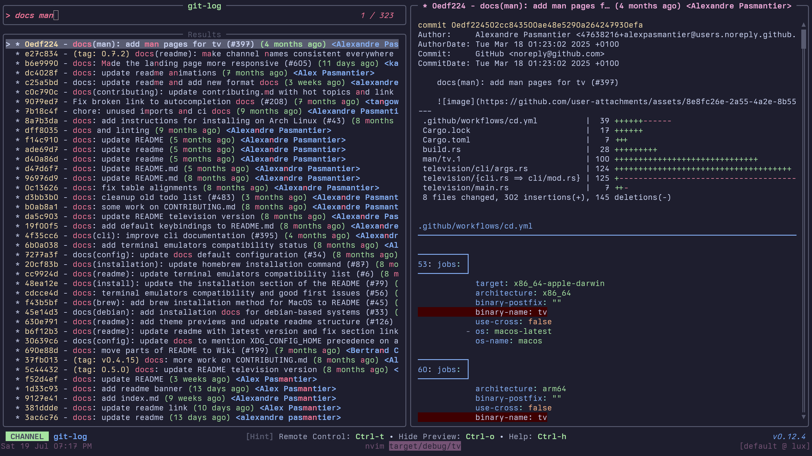

# Contributing new channels

***NOTE**: for general setup information before contributing, see [Contributing](../02-Developers/00-contributing.md).*

Contributing a new channel is as you might expect, pretty straightforward.

1. Create a new branch, add and commit your new channel's TOML file under `cable/unix` (or `cable/windows` depending on your usecase).
2. [OPTIONAL] Add a screenshot of the channel in `assets/channels/<os>/` (e.g. `assets/channels/unix/my_channel.png`).
3. Push your commit and create a PR.
4. The ci should automatically generate the documentation for your channel and pick up the screenshot if available.
5. If 4. fails, you can generate the docs manually by running:
    ```sh
    just generate-cable-docs
    ```


### Examples
#### git-log

```toml
[metadata]
name = "git-log"
description = "A channel to select from git log entries"
requirements = ["git", "delta"]

[source]
command = "git log --graph --pretty=format:'%C(yellow)%h%Creset -%C(yellow)%d%Creset %s %Cgreen(%cr) %C(bold blue)<%an>%Creset' --abbrev-commit --color=always"
output = "{strip_ansi|split: :1}"
ansi = true

[preview]
command = "git show -p --stat --pretty=fuller --color=always '{strip_ansi|split: :1}' | delta"
```

