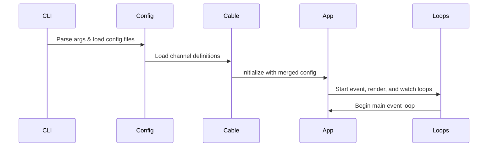
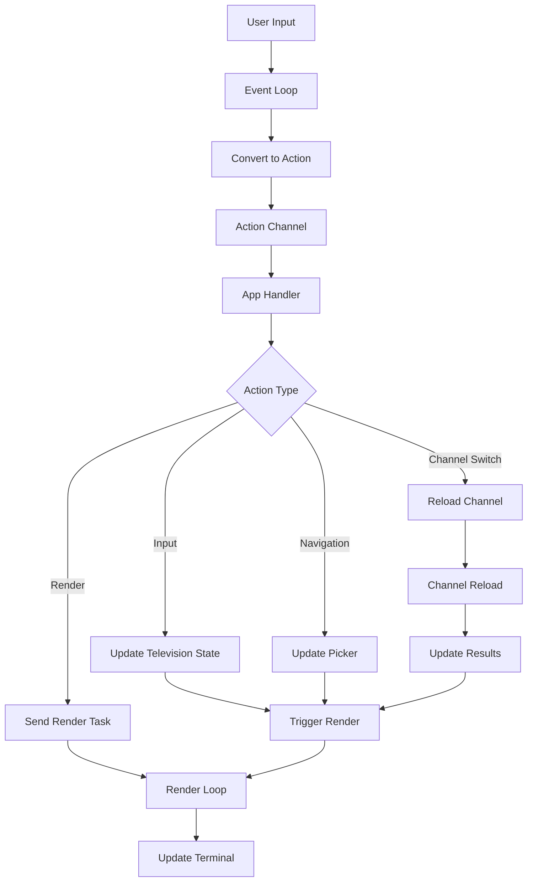
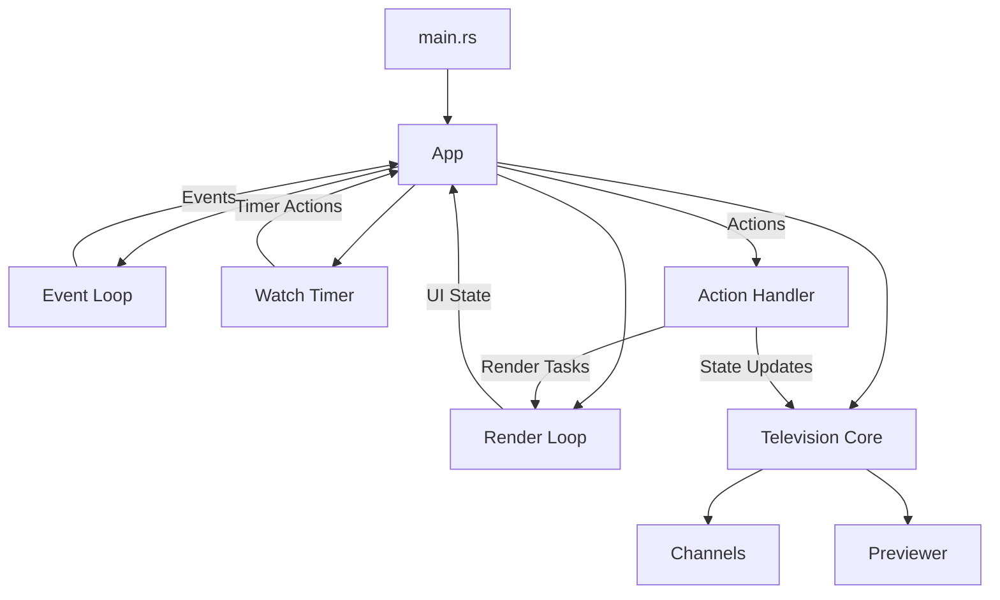
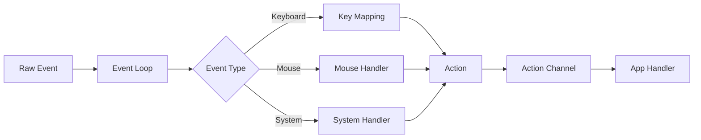
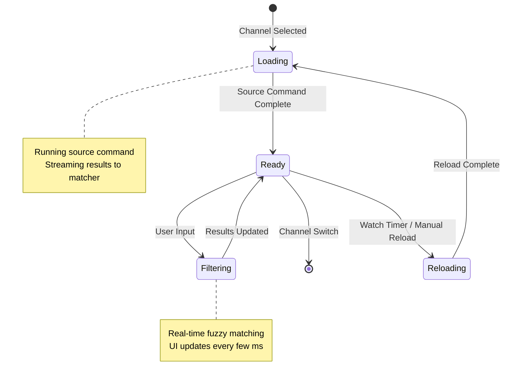
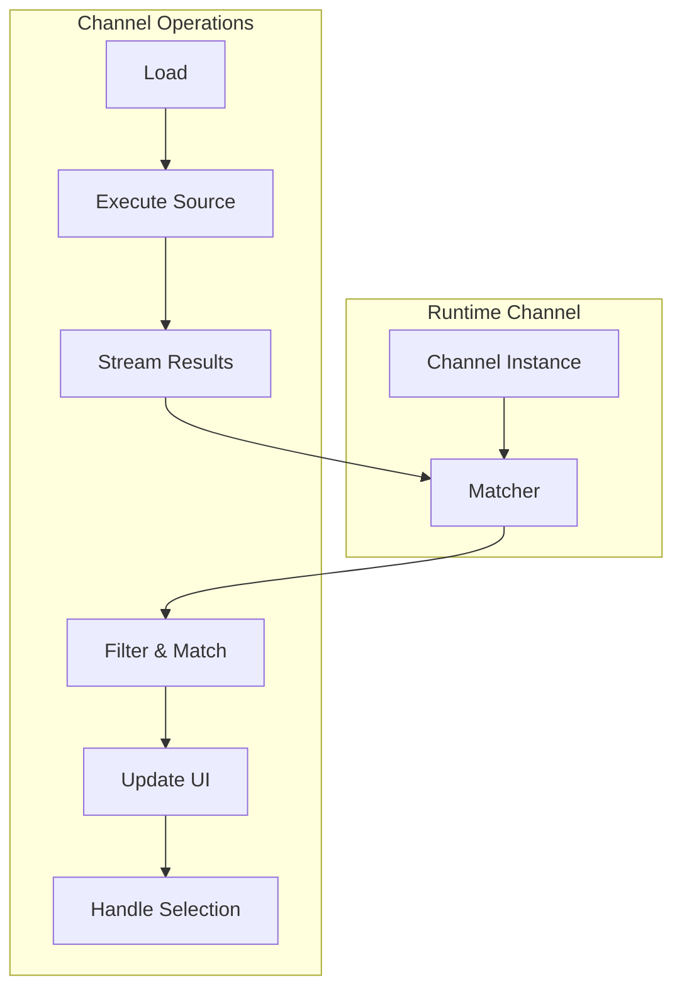
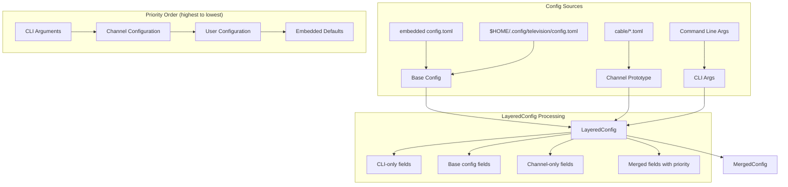
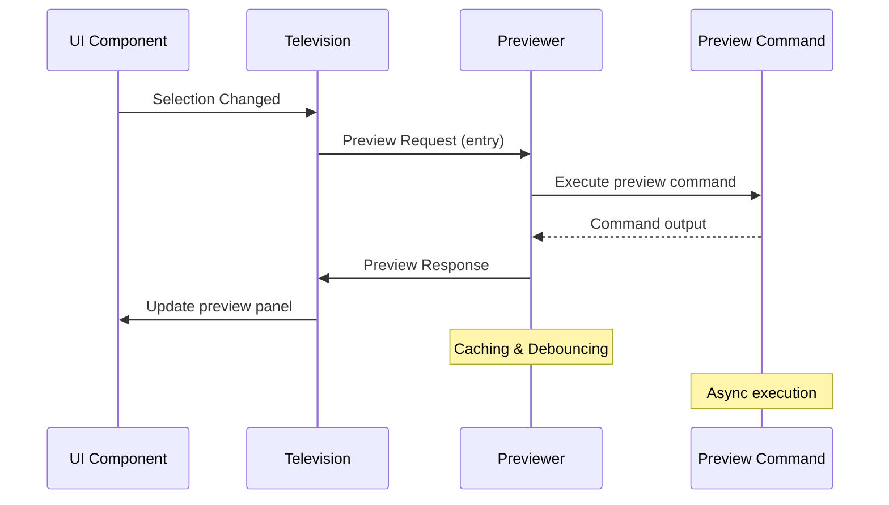
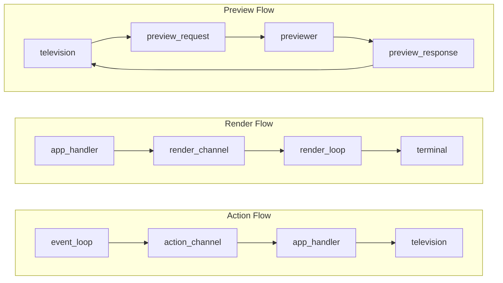

# Architecture Documentation

_NOTE: what follows has mostly been assembled using AI as an experiment and as a basis for further improvements. @lalvarezt and I (@alexpasmantier) have been proofreading it to make sure all the information is technically correct and really reflects the code's architecture, so that **other developers may rely on it as a technical source of truth** when getting started with the repo._

## Overview

Television is a terminal fuzzy finder built with Rust. It uses async/await and separate loops for event handling, rendering, and background tasks to stay responsive.

## High-Level Architecture

```
  ┌──────────────┐    ┌──────────────┐    ┌─────────────┐
  │ CLI & Config  │───►│ Application  │───►│   Output    │
  │              │    │ Orchestrator │    │             │
  └──────────────┘    └──────────────┘    └─────────────┘
                             │
                             ▼
    ┌─────────────────────────────────────────────────┐
    │                   Event Loops                   │
    │ ┌─────────────┐ ┌─────────────┐ ┌─────────────┐ │
    │ │ Event Loop  │ │ Render Loop │ │ Watch Timer │ │
    │ └─────────────┘ └─────────────┘ └─────────────┘ │
    └─────────────────────────────────────────────────┘
                            │
                            ▼
    ┌─────────────────────────────────────────────────┐
    │                 Core Components                 │
    │ ┌─────────────┐ ┌─────────────┐ ┌─────────────┐ │
    │ │  Television │ │  Channels   │ │  Previewer  │ │
    │ │   (State)   │ │  (Sources)  │ │             │ │
    │ └─────────────┘ └─────────────┘ └─────────────┘ │
    └─────────────────────────────────────────────────┘
```

## How It Works

### 1. Startup



### 2. Runtime Event Flow



## Core Components

### Application Orchestrator (`app.rs`)



The main app that coordinates everything:

- **What it does:**
  - Manages app state and lifecycle
  - Routes messages between loops using async channels
  - Handles actions and state changes
  - Starts and stops components

- **Key channels:**
  - `action_tx/rx`: Actions from events to main loop
  - `render_tx/rx`: Rendering tasks to render loop
  - `event_rx`: Events from event loop
  - `ui_state_tx/rx`: UI state feedback from render loop

### Event System

#### Event Loop (`loops/event_loop.rs`)



- **Purpose:** Handles keyboard input, mouse events, and system signals
- **Input:** Key presses, mouse clicks, terminal resize, Ctrl+C
- **Output:** Events sent to main loop
- **Features:**
  - Non-blocking event reading
  - Clean shutdown handling
  - Regular ticks for animations

#### Actions (`action.rs`)

All user interactions become actions:

```rust
pub enum Action {
    // Input actions
    AddInputChar(char),
    DeletePrevChar,

    // Navigation actions
    SelectNextEntry,
    SelectPrevEntry,

    // Application actions
    ConfirmSelection,
    ToggleRemoteControl,
    Render,

    // System actions
    Resize(u16, u16),
    Quit,
}
```

### Television Core (`television.rs`)

The main state manager:

- **What it tracks:**
  - Current mode (Channel vs RemoteControl)
  - Search pattern and matching settings
  - Selected entries and picker state
  - Preview state and handles

- **What it does:**
  - Pattern matching and filtering
  - Entry selection and multi-selection
  - Channel switching and mode changes
  - Preview coordination

### Channel System





#### Channel Config (`channels/prototypes/`)

Channels are defined in TOML files:

```toml
[metadata]
name = "files"
description = "File finder"

[source]
command = "fd -t f"

[preview]
command = "bat --color=always '{}'"

[ui]
preview_panel = { size = 70 }

[keybindings]
shortcut = "f1"
```

#### Channel Runtime (`channels/channel.rs`)

- **Purpose:** Run source commands and manage results
- **Features:**
  - Async command execution with streaming results
  - Fuzzy matching with nucleo
  - Reload with debouncing
  - Multiple source commands

### Rendering System

#### Render Loop (`loops/render_loop.rs`)

- **Purpose:** Update the UI without blocking the main loop
- **Input:** Rendering tasks via channel
- **Output:** Terminal updates and UI state feedback
- **Features:**
  - 60 FPS frame rate capping to avoid CPU hogging
  - Synchronized terminal updates
  - Layout state tracking

#### Drawing (`draw.rs`)

- **Purpose:** Coordinate UI component rendering
- **Components:**
  - Input box with cursor
  - Results list with selection
  - Preview panel with content
  - Status bar with info
  - Remote control panel

### Configuration System

The configuration system uses a three-layer architecture implemented by the `LayeredConfig` struct, which merges configuration from multiple sources with proper priority ordering:



**Key Components:**

- **Base Config**: User configuration loaded from `config.toml`
- **Channel Prototype**: Channel-specific configuration from cable files
- **CLI Configuration**: Runtime overrides from command-line arguments
- **MergedConfig**: Final resolved configuration used by the application

The layered approach allows for:
- Clean separation of concerns between different config sources
- Runtime channel switching without config reloading
- Proper inheritance and override behavior
- Type-safe configuration merging

### Preview System (`previewer/`)



- **How it works:** Separate async task for non-blocking previews
- **Communication:** Request/response via channels
- **Features:**
  - Command-based preview generation
  - Caching and debouncing
  - Error handling and fallbacks
  - Syntax highlighting support

### Watch Timer (`loops/watch_timer.rs`)

- **Purpose:** Automatically reload channels
- **Features:**
  - Configurable intervals per channel
  - Auto start/stop on channel switch
  - Handles missed ticks

## Communication



### Data Flow

- **One direction:** Events → Actions → State changes → Render
- **Feedback:** UI state info flows back for optimization
- **Async:** All blocking operations happen in separate tasks

## Design Patterns

### 1. Actor Model

Each major component runs independently and communicates via messages.

### 2. Command Pattern

All user interactions become Action enums.

### 3. Observer Pattern

UI state changes automatically trigger rendering updates.

### 4. Plugin Architecture

Channels are dynamically loaded from TOML config files.

## Performance

- **Event Processing:** Non-blocking with batched processing
- **Rendering:** Capped at 60 FPS with dirty state tracking
- **Matching:** Incremental fuzzy matching with nucleo
- **Preview:** Async with caching and debouncing
- **Memory:** Bounded result sets with efficient data structures

## How to Extend

### Adding New Channels

1. Create TOML config file
2. Define source command and output format
3. Add preview command and UI settings (optional)
4. Put in cable directory

### Custom Keybindings

- Global keybindings in main config
- Channel-specific keybindings in channel config
- Runtime updates via remote control

### UI Themes

- Color scheme definitions in theme files
- Component-specific styling
- Runtime theme switching

This architecture keeps things modular and fast, with clear separation between components and efficient async communication.
