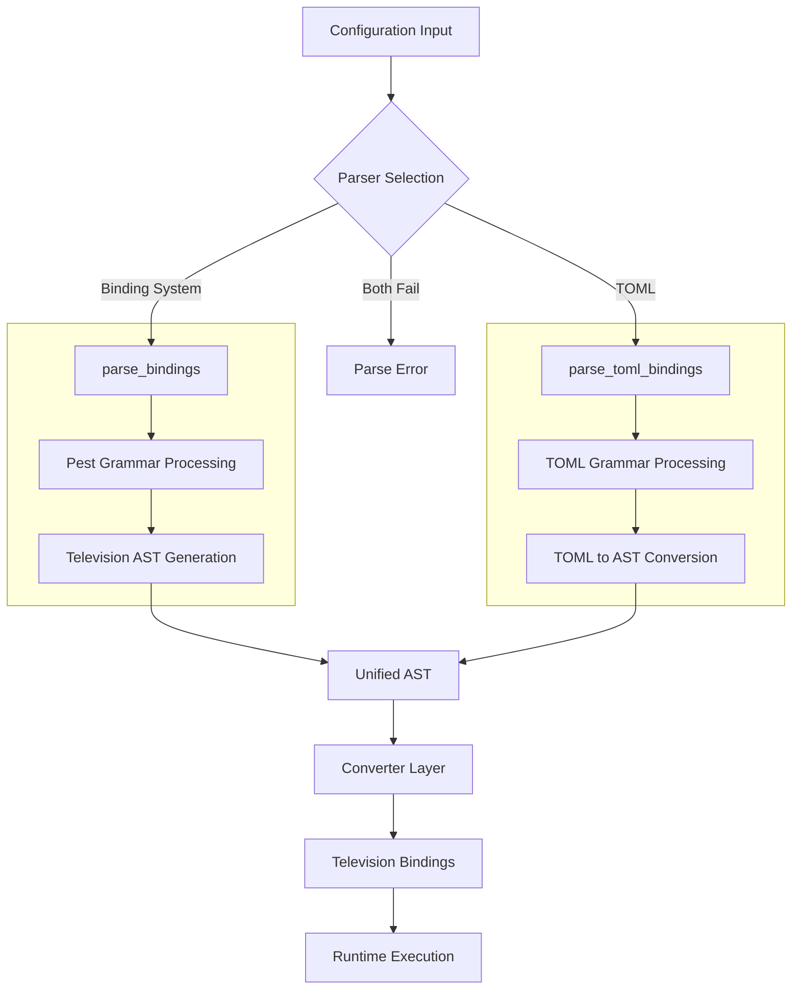
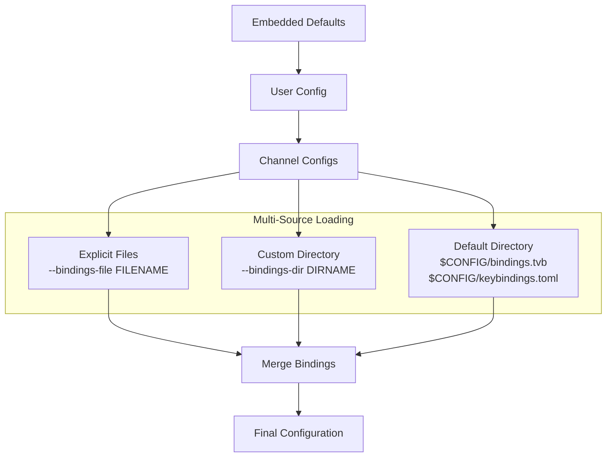
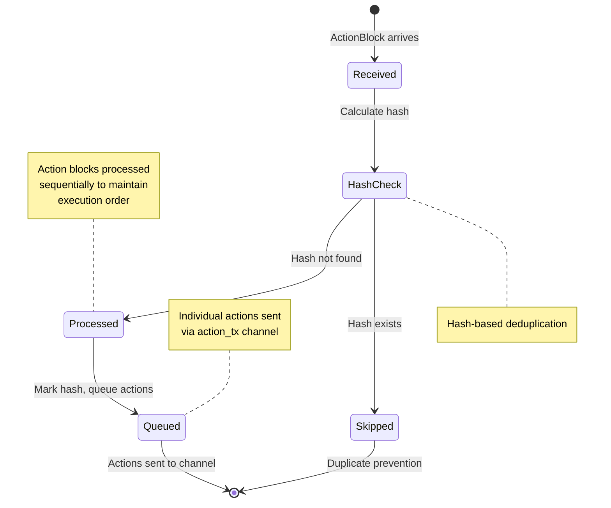

# Binding System Architecture

## Overview

The Television binding system maps keys and events to actions using a dual-format parser (Television syntax + TOML) built on Pest. The system supports channel-specific bindings, action blocks, event bindings, and multi-source configuration loading.



## Grammar Definition

### Core Grammar Structure

```pest
// Dual format support
file = { SOI ~ (bindings | toml_bindings)? ~ EOI }

// Television syntax
bindings = { "bindings" ~ "{" ~ binding* ~ "}" }
binding = {
    key_binding | event_binding | channel_binding |
    for_channels_binding | comment
}

// Binding types
key_binding = { key_sequence ~ "=>" ~ action_target ~ ";" }
event_binding = { "@" ~ event_name ~ "=>" ~ action_target ~ ";" }
channel_binding = { "channel" ~ string_literal ~ "{" ~ binding* ~ "}" }
for_channels_binding = { "for_channels" ~ "(" ~ string_literal ~ ")" ~ "{" ~ binding* ~ "}" }

// Action targets
action_target = { action_block | action_array | action_name }
action_block = { "{" ~ action_name ~ (";" ~ action_name)* ~ "}" }
action_array = { "[" ~ action_name ~ ("," ~ action_name)* ~ "]" }

// TOML format support
toml_bindings = { toml_section+ }
toml_section = { "[" ~ section_name ~ "]" ~ toml_entry* }
```

### Key Grammar Components

```pest
// Key specifications
key_sequence = { (modifier ~ "-")* ~ key_name }
modifier = { "ctrl" | "alt" | "shift" }
key_name = { named_key | function_key | character_key | mouse_event }

// Named keys
named_key = {
    "enter" | "esc" | "tab" | "space" | "backspace" | "delete" |
    "home" | "end" | "pageup" | "pagedown" | "insert" |
    "up" | "down" | "left" | "right" | "backtab"
}

// Function keys and mouse events
function_key = { "f" ~ number }
mouse_event = { "mouse-scroll-up" | "mouse-scroll-down" }

// Event specifications
event_name = {
    "start" | "load" | "result" | "one" | "zero" |
    "selection-change" | "resize"
}
```

## Hierarchical Configuration Merging



## Action Block State Management



## Grammar Extensions (not Implemented)

- 🔄 Parameterized action execution
- 🔄 Advanced pattern matching for channels
- 🔄 Conditional binding logic
- 🔄 Runtime binding modification
- 🔄 LSP support using AST span information
