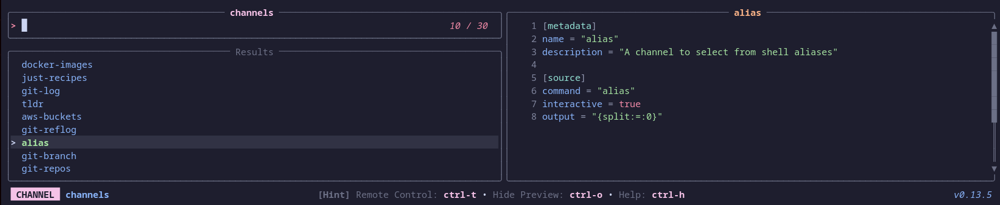
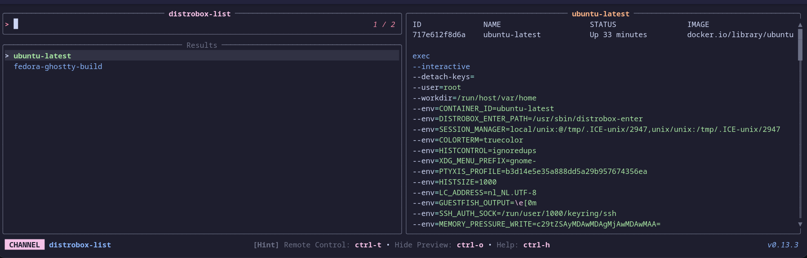
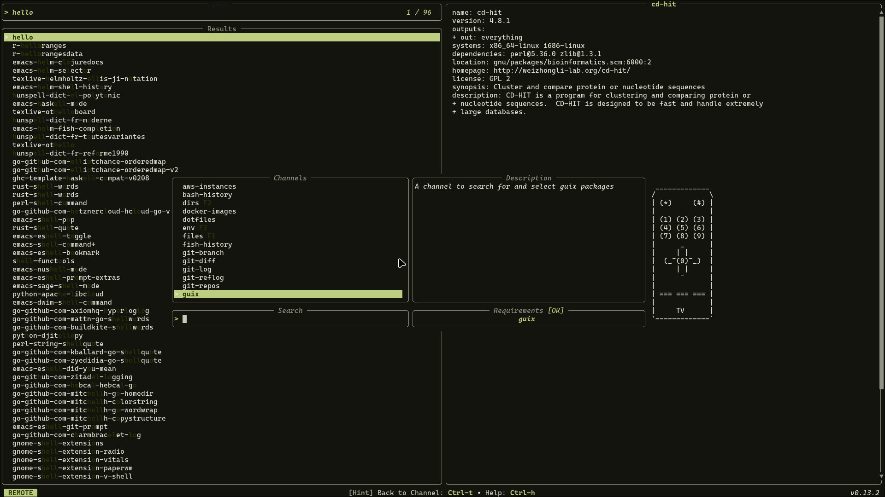
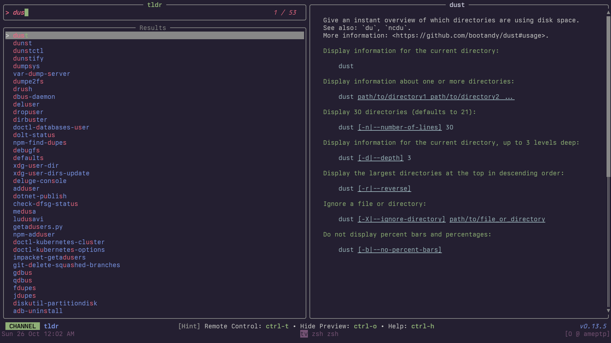

# Community Channels (unix)

### *alias*

A channel to select from shell aliases

**Requirements:** *None*

**Code:** *alias.toml*

```toml
[metadata]
name = "alias"
description = "A channel to select from shell aliases"

[source]
command = "$SHELL -ic 'alias'"
output = "{split:=:0}"

[preview]
command = "$SHELL -ic 'alias' | grep -E '^(alias )?{split:=:0}='"

[ui.preview_panel]
size = 30

```


---

### *apt-packages*

List and manage installed apt packages

**Requirements:** `dpkg`, `apt`

**Code:** *apt-packages.toml*

```toml
[metadata]
name = "apt-packages"
description = "List and manage installed apt packages"
requirements = [ "dpkg", "apt",]

[source]
command = "dpkg-query -W -f='${Package}\t${Version}\t${Status}\n' 2>/dev/null | grep 'install ok installed' | awk -F'\t' '{print $1, $2}'"
output = "{split: :0}"

[preview]
command = "apt show '{split: :0}' 2>/dev/null"

[actions.remove]
description = "Remove the selected package"
command = "sudo apt remove '{split: :0}'"
mode = "execute"

[actions.reinstall]
description = "Reinstall the selected package"
command = "sudo apt install --reinstall '{split: :0}'"
mode = "execute"

```


---

### *aws-buckets*

List and preview AWS S3 Buckets


**Requirements:** `aws`

**Code:** *aws-buckets.toml*

```toml
[metadata]
name = "aws-buckets"
description = "List and preview AWS S3 Buckets"
requirements = [ "aws",]

[source]
command = "aws s3 ls --output text"
output = "{split: :3|trim}"

[preview]
command = "aws s3 ls s3://{split: :3|trim} --human-readable --summarize"

[ui]
layout = "portrait"

[ui.preview_panel]
size = 60

[actions.list]
description = "List all objects in the selected bucket"
command = "aws s3 ls s3://{split: :3|trim} --recursive --human-readable | less"
mode = "execute"

```


---

### *aws-instances*

List and preview AWS EC2 Instances

**Requirements:** `aws`

**Code:** *aws-instances.toml*

```toml
[metadata]
name = "aws-instances"
description = "List and preview AWS EC2 Instances"
requirements = [ "aws",]

[source]
command = "aws ec2 describe-instances --output text --query \"Reservations[*].Instances[*].[InstanceId,Tags[?Key=='Name']|[0].Value]\""

[preview]
command = "aws ec2 describe-instances --output json --instance-ids {split:\t:0} --query 'Reservations[*].Instances[0]'"

[ui]
layout = "portrait"

[ui.preview_panel]
size = 60

[actions.start]
description = "Start the selected EC2 instance"
command = "aws ec2 start-instances --instance-ids {split:\t:0}"
mode = "fork"

[actions.stop]
description = "Stop the selected EC2 instance"
command = "aws ec2 stop-instances --instance-ids {split:\t:0}"
mode = "fork"

[actions.ssm]
description = "Start an SSM session on the selected instance"
command = "aws ssm start-session --target {split:\t:0}"
mode = "execute"

```


---

### *aws-profiles*

List and switch AWS CLI profiles

**Requirements:** `aws`, `grep`

**Code:** *aws-profiles.toml*

```toml
[metadata]
name = "aws-profiles"
description = "List and switch AWS CLI profiles"
requirements = [ "aws", "grep",]

[source]
command = "grep '\\[profile' ~/.aws/config 2>/dev/null | sed 's/\\[profile //' | sed 's/\\]//' || grep '\\[' ~/.aws/credentials 2>/dev/null | sed 's/\\[//' | sed 's/\\]//'"

[preview]
command = "aws configure list --profile '{}' 2>/dev/null"

[keybindings]
enter = "actions:export"

[ui.preview_panel]
size = 40

[actions.export]
description = "Export the selected profile (sets AWS_PROFILE)"
command = "export AWS_PROFILE='{}' && echo \"AWS_PROFILE set to '{}'\" && $SHELL"
mode = "execute"

```


---

### *bash-history*

A channel to select from your bash history

**Requirements:** `bash`

**Code:** *bash-history.toml*

```toml
[metadata]
name = "bash-history"
description = "A channel to select from your bash history"
requirements = [ "bash",]

[source]
command = "sed '1!G;h;$!d' ${HISTFILE:-${HOME}/.bash_history}"
no_sort = true
frecency = false

```


---

### *brew-packages*

List and manage Homebrew packages

**Requirements:** `brew`

**Code:** *brew-packages.toml*

```toml
[metadata]
name = "brew-packages"
description = "List and manage Homebrew packages"
requirements = [ "brew",]

[source]
command = [ "brew list --formula", "brew list --cask",]

[preview]
command = "brew info '{}'"

[ui]
layout = "portrait"

[keybindings]
ctrl-u = "actions:upgrade"
ctrl-d = "actions:uninstall"

[actions.upgrade]
description = "Upgrade the selected package"
command = "brew upgrade '{}'"
mode = "execute"

[actions.uninstall]
description = "Uninstall the selected package"
command = "brew uninstall '{}'"
mode = "execute"

```


---

### *cargo-commands*

List available cargo commands and extensions

**Requirements:** `cargo`

**Code:** *cargo-commands.toml*

```toml
[metadata]
name = "cargo-commands"
description = "List available cargo commands and extensions"
requirements = [ "cargo",]

[source]
command = "cargo --list 2>/dev/null | tail -n +2 | awk '{print $1}'"

[preview]
command = "cargo {} --help 2>/dev/null | head -50"

[ui]
layout = "portrait"

[keybindings]
enter = "actions:run"

[ui.preview_panel]
size = 60

[actions.run]
description = "Run the selected cargo command"
command = "cargo '{}'"
mode = "execute"

```


---

### *cargo-crates*

List installed cargo crates

**Requirements:** `cargo`

**Code:** *cargo-crates.toml*

```toml
[metadata]
name = "cargo-crates"
description = "List installed cargo crates"
requirements = [ "cargo",]

[source]
command = "cargo install --list 2>/dev/null | grep -v '^    ' | sed 's/:$//'"
display = "{split: :0} {split: :1}"
output = "{split: :0}"

[preview]
command = "cargo install --list 2>/dev/null | sed -n '/^{split: :0} /,/^[^ ]/p' | head -20"

[actions.uninstall]
description = "Uninstall the selected crate"
command = "cargo uninstall '{split: :0}'"
mode = "execute"

```


---

### *channels*

Select a television channel


**Requirements:** `tv`, `bat`

**Code:** *channels.toml*

```toml
[metadata]
name = "channels"
description = "Select a television channel"
requirements = [ "tv", "bat",]

[source]
command = [ "tv list-channels",]

[preview]
command = "bat -pn --color always ${XDG_CONFIG_HOME:-$HOME/.config}/television/cable/**/{}.toml"

[keybindings]
enter = "actions:channel-enter"

[actions.channel-enter]
description = "Enter a television channel"
command = "tv {}"
mode = "execute"

```


---

### *crontab*

List and manage crontab entries

**Requirements:** *None*

**Code:** *crontab.toml*

```toml
[metadata]
name = "crontab"
description = "List and manage crontab entries"

[source]
command = "crontab -l 2>/dev/null | grep -v '^#' | grep -v '^$'"
no_sort = true
frecency = false

[preview]
command = "echo 'Schedule: {split: :..5}' && echo '' && echo 'Command:' && echo '{split: :5..}' "

[ui]
layout = "portrait"

[ui.preview_panel]
size = 30

[actions.edit]
description = "Open crontab for editing"
command = "crontab -e"
mode = "execute"

```


---

### *dirs*

A channel to select from directories

**Requirements:** `fd`

**Code:** *dirs.toml*

```toml
[metadata]
name = "dirs"
description = "A channel to select from directories"
requirements = [ "fd",]

[source]
command = [ "fd -t d", "fd -t d --hidden",]

[preview]
command = "ls -la --color=always '{}'"

[keybindings]
shortcut = "f2"

[actions.cd]
description = "Open a shell in the selected directory"
command = "cd '{}' && $SHELL"
mode = "execute"

[actions.goto_parent_dir]
description = "Re-opens tv in the parent directory"
command = "tv dirs .."
mode = "execute"

```


---

### *distrobox-list*

A channel to select a container from distrobox


**Requirements:** `distrobox`, `bat`

**Code:** *distrobox-list.toml*

```toml
[metadata]
name = "distrobox-list"
description = "A channel to select a container from distrobox"
requirements = [ "distrobox", "bat",]

[source]
command = [ "distrobox list | awk -F '|' '{ gsub(/ /, \"\", $2); print $2}' | tail --lines=+2",]

[preview]
command = "(distrobox list | column -t -s '|' | awk -v selected_name={} 'NR==1 || $0 ~ selected_name') && echo && distrobox enter -d {} | bat --plain --color=always -lbash"

[keybindings]
ctrl-e = "actions:distrobox-enter"
ctrl-l = "actions:distrobox-list"
ctrl-r = "actions:distrobox-rm"
ctrl-s = "actions:distrobox-stop"
ctrl-u = "actions:distrobox-upgrade"

[actions.distrobox-enter]
description = "Enter a distrobox"
command = "distrobox enter {}"
mode = "execute"

[actions.distrobox-list]
description = "List a distrobox"
command = "distrobox list | column -t -s '|' | awk -v selected_name={} 'NR==1 || $0 ~ selected_name'"
mode = "execute"

[actions.distrobox-rm]
description = "Remove a distrobox"
command = "distrobox rm {}"
mode = "execute"

[actions.distrobox-stop]
description = "Stop a distrobox"
command = "distrobox stop {}"
mode = "execute"

[actions.distrobox-upgrade]
description = "Upgrade a distrobox"
command = "distrobox upgrade {}"
mode = "execute"

```


---

### *docker-compose*

Manage Docker Compose services

**Requirements:** `docker`

**Code:** *docker-compose.toml*

```toml
[metadata]
name = "docker-compose"
description = "Manage Docker Compose services"
requirements = [ "docker",]

[source]
command = "docker compose ps --format '{{.Name}}\t{{.Service}}\t{{.Status}}'"
display = "{split:\t:1} ({split:\t:2})"
output = "{split:\t:1}"

[preview]
command = "docker compose logs --tail=30 --no-log-prefix '{split:\t:1}'"

[actions.up]
description = "Start the selected service"
command = "docker compose up -d '{split:\t:1}'"
mode = "fork"

[actions.down]
description = "Stop and remove the selected service"
command = "docker compose down '{split:\t:1}'"
mode = "fork"

[actions.restart]
description = "Restart the selected service"
command = "docker compose restart '{split:\t:1}'"
mode = "fork"

[actions.logs]
description = "Follow logs of the selected service"
command = "docker compose logs -f '{split:\t:1}'"
mode = "execute"

```


---

### *docker-containers*

List and manage Docker containers

**Requirements:** `docker`

**Code:** *docker-containers.toml*

```toml
[metadata]
name = "docker-containers"
description = "List and manage Docker containers"
requirements = [ "docker",]

[source]
command = [ "docker ps --format '{{.Names}}\\t{{.Image}}\\t{{.Status}}'", "docker ps -a --format '{{.Names}}\\t{{.Image}}\\t{{.Status}}'",]
display = "{split:\\t:0} ({split:\\t:2})"
output = "{split:\\t:0}"

[preview]
command = "docker inspect '{split:\\t:0}' | jq -C '.[0] | {Name, State, Config: {Image: .Config.Image, Cmd: .Config.Cmd}, NetworkSettings: {IPAddress: .NetworkSettings.IPAddress}}'"

[ui]
layout = "portrait"

[keybindings]
ctrl-s = "actions:start"
f2 = "actions:stop"
ctrl-r = "actions:restart"
ctrl-l = "actions:logs"
ctrl-e = "actions:exec"
ctrl-d = "actions:remove"

[actions.start]
description = "Start the selected container"
command = "docker start '{split:\\t:0}'"
mode = "fork"

[actions.stop]
description = "Stop the selected container"
command = "docker stop '{split:\\t:0}'"
mode = "fork"

[actions.restart]
description = "Restart the selected container"
command = "docker restart '{split:\\t:0}'"
mode = "fork"

[actions.logs]
description = "Follow logs of the selected container"
command = "docker logs -f '{split:\\t:0}'"
mode = "execute"

[actions.exec]
description = "Execute shell in the selected container"
command = "docker exec -it '{split:\\t:0}' /bin/sh"
mode = "execute"

[actions.remove]
description = "Remove the selected container"
command = "docker rm '{split:\\t:0}'"
mode = "execute"

```


---

### *docker-images*

A channel to select from Docker images

**Requirements:** `docker`, `jq`

**Code:** *docker-images.toml*

```toml
[metadata]
name = "docker-images"
description = "A channel to select from Docker images"
requirements = [ "docker", "jq",]

[source]
command = "docker images --format '{{.Repository}}:{{.Tag}} {{.ID}}'"
output = "{split: :-1}"

[preview]
command = "docker image inspect '{split: :-1}' | jq -C"

[ui]
layout = "portrait"

[keybindings]
ctrl-r = "actions:run"
ctrl-d = "actions:remove"
ctrl-s = "actions:shell"

[actions.run]
description = "Run a container from the selected image"
command = "docker run -it '{split: :-1}'"
mode = "execute"

[actions.shell]
description = "Run a shell in the selected image"
command = "docker run -it '{split: :-1}' /bin/sh"
mode = "execute"

[actions.remove]
description = "Remove the selected image"
command = "docker rmi '{split: :-1}'"
mode = "execute"

```


---

### *docker-networks*

List and manage Docker networks

**Requirements:** `docker`

**Code:** *docker-networks.toml*

```toml
[metadata]
name = "docker-networks"
description = "List and manage Docker networks"
requirements = [ "docker",]

[source]
command = "docker network ls --format '{{.Name}}\t{{.Driver}}\t{{.Scope}}'"
display = "{split:\t:0} ({split:\t:1}, {split:\t:2})"
output = "{split:\t:0}"

[preview]
command = "docker network inspect '{split:\t:0}' | jq -C '.[0] | {Name, Driver, Scope, IPAM, Containers: (.Containers // {} | to_entries | map({name: .value.Name, ipv4: .value.IPv4Address}))}'"

[ui]
layout = "portrait"

[actions.remove]
description = "Remove the selected network"
command = "docker network rm '{split:\t:0}'"
mode = "execute"

```


---

### *docker-volumes*

List and manage Docker volumes

**Requirements:** `docker`

**Code:** *docker-volumes.toml*

```toml
[metadata]
name = "docker-volumes"
description = "List and manage Docker volumes"
requirements = [ "docker",]

[source]
command = "docker volume ls --format '{{.Name}}\t{{.Driver}}'"
display = "{split:\t:0} ({split:\t:1})"
output = "{split:\t:0}"

[preview]
command = "docker volume inspect '{split:\t:0}' | jq -C '.[0]'"

[ui]
layout = "portrait"

[actions.remove]
description = "Remove the selected volume"
command = "docker volume rm '{split:\t:0}'"
mode = "execute"

[actions.inspect]
description = "Inspect the selected volume in a pager"
command = "docker volume inspect '{split:\t:0}' | jq -C '.[0]' | less -R"
mode = "execute"

```


---

### *dotfiles*

A channel to select from your user's dotfiles

**Requirements:** `fd`, `bat`

**Code:** *dotfiles.toml*

```toml
[metadata]
name = "dotfiles"
description = "A channel to select from your user's dotfiles"
requirements = [ "fd", "bat",]

[source]
command = "fd -t f . $HOME/.config"

[preview]
command = "bat -n --color=always '{}'"

[keybindings]
enter = "actions:edit"

[actions.edit]
description = "Edit the selected dotfile"
command = "${EDITOR:-vim} '{}'"
mode = "execute"

```


---

### *downloads*

Browse recent files in Downloads folder

**Requirements:** `fd`, `bat`

**Code:** *downloads.toml*

```toml
[metadata]
name = "downloads"
description = "Browse recent files in Downloads folder"
requirements = [ "fd", "bat",]

[source]
command = "fd -t f . ~/Downloads 2>/dev/null | head -200"

[preview]
command = "bat -n --color=always '{}' 2>/dev/null || file '{}'"

[keybindings]
enter = "actions:open"
ctrl-d = "actions:delete"
ctrl-m = "actions:move"

[preview.env]
BAT_THEME = "ansi"

[actions.open]
description = "Open the selected file with default application"
command = "xdg-open '{}' 2>/dev/null || open '{}'"
mode = "fork"

[actions.delete]
description = "Delete the selected file"
command = "rm -i '{}'"
mode = "execute"

[actions.move]
description = "Move the selected file to current directory"
command = "mv '{}' ."
mode = "fork"

```


---

### *env*

A channel to select from environment variables

**Requirements:** *None*

**Code:** *env.toml*

```toml
[metadata]
name = "env"
description = "A channel to select from environment variables"

[source]
command = "printenv"
output = "{split:=:1..}"

[preview]
command = "echo '{split:=:1..}'"

[ui]
layout = "portrait"

[keybindings]
shortcut = "f3"

[ui.preview_panel]
size = 20
header = "{split:=:0}"

[actions.name]
description = "Output the variable name instead of the value"
command = "echo '{split:=:0}'"
mode = "execute"

```


---

### *files*

A channel to select files and directories

**Requirements:** `fd`, `bat`

**Code:** *files.toml*

```toml
[metadata]
name = "files"
description = "A channel to select files and directories"
requirements = [ "fd", "bat",]

[source]
command = [ "fd -t f", "fd -t f -H",]

[preview]
command = "bat -n --color=always '{}'"

[keybindings]
shortcut = "f1"
f12 = "actions:edit"
ctrl-up = "actions:goto_parent_dir"

[preview.env]
BAT_THEME = "ansi"

[actions.edit]
description = "Opens the selected entries with the default editor (falls back to vim)"
command = "${EDITOR:-vim} '{}'"
mode = "execute"

[actions.goto_parent_dir]
description = "Re-opens tv in the parent directory"
command = "tv files .."
mode = "execute"

```


---

### *fish-history*

A channel to select from your fish history

**Requirements:** `fish`

**Code:** *fish-history.toml*

```toml
[metadata]
name = "fish-history"
description = "A channel to select from your fish history"
requirements = [ "fish",]

[source]
command = "fish -c 'history'"
no_sort = true
frecency = false

```


---

### *flatpak*

List and manage Flatpak applications

**Requirements:** `flatpak`

**Code:** *flatpak.toml*

```toml
[metadata]
name = "flatpak"
description = "List and manage Flatpak applications"
requirements = [ "flatpak",]

[source]
command = "flatpak list --app --columns=application,name,version 2>/dev/null"
display = "{split:\t:1} ({split:\t:2})"
output = "{split:\t:0}"

[preview]
command = "flatpak info '{split:\t:0}' 2>/dev/null"

[actions.run]
description = "Launch the selected application"
command = "flatpak run '{split:\t:0}'"
mode = "execute"

[actions.uninstall]
description = "Uninstall the selected application"
command = "flatpak uninstall '{split:\t:0}'"
mode = "execute"

[actions.update]
description = "Update the selected application"
command = "flatpak update '{split:\t:0}'"
mode = "execute"

```


---

### *fonts*

List installed system fonts

**Requirements:** `fc-list`

**Code:** *fonts.toml*

```toml
[metadata]
name = "fonts"
description = "List installed system fonts"
requirements = [ "fc-list",]

[source]
command = "fc-list --format='%{family}\n' | sort -uf"

[preview]
command = "fc-list '{}' --format='%{file}\n%{style}\n%{family}\n' | head -20"

[ui.preview_panel]
size = 70

```


---

### *gh-issues*

List GitHub issues for the current repo


**Requirements:** `gh`, `jq`

**Code:** *gh-issues.toml*

```toml
[metadata]
name = "gh-issues"
description = "List GitHub issues for the current repo"
requirements = [ "gh", "jq",]

[source]
command = "gh issue list --state open --limit 100 --json number,title,createdAt,author,labels | jq -r 'sort_by(.createdAt) | reverse | .[] | \"  \\u001b[32m#\\(.number)\\u001b[39m   \\(.title) \\u001b[33m@\\(.author.login)\\u001b[39m\" + (if (.labels | length) > 0 then \" \" + ([.labels[] | \"\\u001b[35m\" + .name + \"\\u001b[39m\"] | join(\" \")) else \"\" end)'\n"
ansi = true
output = "{strip_ansi|split:#:1|split: :0}"

[ui]
layout = "portrait"

[preview]
command = "gh issue view '{strip_ansi|split:\n\"  \" + .title,\n\"  #\" + (.number | tostring),\n\"\",\n\"  \\u001b[36mStatus:\\u001b[39m \\u001b[32m\" + .state + \"\\u001b[39m\",\n\"  \\u001b[36mAuthor:\\u001b[39m \\u001b[33m\" + .author.login + \"\\u001b[39m\",\n\"  \\u001b[36mCreated:\\u001b[39m \" + (.createdAt | fromdateiso8601 | (now - .) | if . < 3600 then (./60|floor|tostring) + \" minutes ago\" elif . < 86400 then (./3600|floor|tostring) + \" hours ago\" else (./86400|floor|tostring) + \" days ago\" end),\n\"  \\u001b[36mUpdated:\\u001b[39m \" + (.updatedAt | fromdateiso8601 | (now - .) | if . < 3600 then (./60|floor|tostring) + \" minutes ago\" elif . < 86400 then (./3600|floor|tostring) + \" hours ago\" else (./86400|floor|tostring) + \" days ago\" end),\n(if (.labels | length) > 0 then \"  \\u001b[36mLabels:\\u001b[39m \" + ([.labels[] | \"\\u001b[35m\" + .name + \"\\u001b[39m\"] | join(\" \")) else \"\" end),\n(if (.assignees | length) > 0 then \"  \\u001b[36mAssignees:\\u001b[39m \" + ([.assignees[].login] | join(\", \")) else \"\" end),\n\"\",\n\"  \\u001b[90m────────────────────────────────────────────────────────────\\u001b[39m\",\n\"\",\n(.body // \"\")'\n"

[ui.preview_panel]
header = "{strip_ansi|split:#:1|split: :0}"

[actions.open]
description = "Open the issue in the browser"
command = "gh issue view {strip_ansi|split:#:1|split: :0} --web"
mode = "fork"

[actions.close]
description = "Close the selected issue"
command = "gh issue close {strip_ansi|split:#:1|split: :0}"
mode = "fork"

[actions.comment]
description = "Add a comment to the selected issue"
command = "gh issue comment {strip_ansi|split:#:1|split: :0}"
mode = "execute"

```


---

### *gh-prs*

List GitHub PRs for the current repo


**Requirements:** `gh`, `jq`

**Code:** *gh-prs.toml*

```toml
[metadata]
name = "gh-prs"
description = "List GitHub PRs for the current repo"
requirements = [ "gh", "jq",]

[source]
command = "gh pr list --state open --limit 100 --json number,title,createdAt,author,labels | jq -r 'sort_by(.createdAt) | reverse | .[] | \"  \\u001b[32m#\\(.number)\\u001b[39m   \\(.title) \\u001b[33m@\\(.author.login)\\u001b[39m\" + (if (.labels | length) > 0 then \" \" + ([.labels[] | \"\\u001b[35m\" + .name + \"\\u001b[39m\"] | join(\" \")) else \"\" end)'\n"
output = "{strip_ansi|split:#:1|split:   :0}"
ansi = true

[ui]
layout = "portrait"

[preview]
command = "gh pr view '{strip_ansi|split:\n\"  \" + .title,\n\"  #\" + (.number | tostring),\n\"\",\n\"  \\u001b[36mStatus:\\u001b[39m \\u001b[32m\" + .state + \"\\u001b[39m  \" + .baseRefName + \" ← \" + .headRefName,\n\"  \\u001b[36mRepo:\\u001b[39m \\u001b[34m\" + (.headRepositoryOwner.login) + \"/\" + (.headRepository.name) + \"\\u001b[39m\",\n\"  \\u001b[36mAuthor:\\u001b[39m \\u001b[33m\" + .author.login + \"\\u001b[39m\",\n\"  \\u001b[36mCreated:\\u001b[39m \" + (.createdAt | fromdateiso8601 | (now - .) | if . < 3600 then (./60|floor|tostring) + \" minutes ago\" elif . < 86400 then (./3600|floor|tostring) + \" hours ago\" else (./86400|floor|tostring) + \" days ago\" end),\n\"  \\u001b[36mUpdated:\\u001b[39m \" + (.updatedAt | fromdateiso8601 | (now - .) | if . < 3600 then (./60|floor|tostring) + \" minutes ago\" elif . < 86400 then (./3600|floor|tostring) + \" hours ago\" else (./86400|floor|tostring) + \" days ago\" end),\n(if (.labels | length) > 0 then \"  \\u001b[36mLabels:\\u001b[39m \" + ([.labels[] | \"\\u001b[35m\" + .name + \"\\u001b[39m\"] | join(\" \")) else \"\" end),\n\"  \\u001b[36mMerge Status:\\u001b[39m \" + (if .mergeable == \"MERGEABLE\" then \"\\u001b[32m✓ Clean\\u001b[39m\" elif .mergeable == \"CONFLICTING\" then \"\\u001b[31m✗ Dirty\\u001b[39m\" else \"\\u001b[33m? Unknown\\u001b[39m\" end),\n\"  \\u001b[36mChanges:\\u001b[39m \" + (.changedFiles | tostring) + \" files  \\u001b[32m+\" + (.additions | tostring) + \"\\u001b[39m \\u001b[31m-\" + (.deletions | tostring) + \"\\u001b[39m\",\n\"\",\n\"  \\u001b[90m────────────────────────────────────────────────────────────\\u001b[39m\",\n\"\",\n(.body // \"\")'\n"

[actions.open]
description = "Open the PR in the browser"
command = "gh pr view {strip_ansi|split:#:1|split:   :0} --web"
mode = "execute"

[actions.checkout]
description = "Checkout the PR branch locally"
command = "gh pr checkout {strip_ansi|split:#:1|split:   :0}"
mode = "execute"

[actions.merge]
description = "Merge the selected PR"
command = "gh pr merge {strip_ansi|split:#:1|split:   :0}"
mode = "execute"

[actions.diff]
description = "View the PR diff"
command = "gh pr diff {strip_ansi|split:#:1|split:   :0} | less"
mode = "execute"

```


---

### *git-branch*

A channel to select from git branches

**Requirements:** `git`

**Code:** *git-branch.toml*

```toml
[metadata]
name = "git-branch"
description = "A channel to select from git branches"
requirements = [ "git",]

[source]
command = "git --no-pager branch --all --format=\"%(refname:short)\""
output = "{split: :0}"

[preview]
command = "git show -p --stat --pretty=fuller --color=always '{0}'"

[keybindings]
enter = "actions:checkout"
ctrl-d = "actions:delete"
ctrl-m = "actions:merge"
ctrl-r = "actions:rebase"

[actions.checkout]
description = "Checkout the selected branch"
command = "git checkout '{0}'"
mode = "execute"

[actions.delete]
description = "Delete the selected branch"
command = "git branch -d '{0}'"
mode = "execute"

[actions.merge]
description = "Merge the selected branch into current branch"
command = "git merge '{0}'"
mode = "execute"

[actions.rebase]
description = "Rebase current branch onto the selected branch"
command = "git rebase '{0}'"
mode = "execute"

```


---

### *git-diff*

A channel to select files from git diff commands

**Requirements:** `git`

**Code:** *git-diff.toml*

```toml
[metadata]
name = "git-diff"
description = "A channel to select files from git diff commands"
requirements = [ "git",]

[source]
command = "git diff --name-only HEAD"

[preview]
command = "git diff HEAD --color=always -- '{}'"

[ui]
layout = "portrait"

[keybindings]
ctrl-s = "actions:stage"
ctrl-r = "actions:restore"
ctrl-e = "actions:edit"

[actions.stage]
description = "Stage the selected file"
command = "git add '{}'"
mode = "fork"

[actions.restore]
description = "Discard changes in the selected file"
command = "git restore '{}'"
mode = "fork"

[actions.edit]
description = "Open the selected file in editor"
command = "${EDITOR:-vim} '{}'"
mode = "execute"

```


---

### *git-log*

A channel to select from git log entries

**Requirements:** `git`

**Code:** *git-log.toml*

```toml
[metadata]
name = "git-log"
description = "A channel to select from git log entries"
requirements = [ "git",]

[source]
command = "git log --graph --pretty=format:'%C(yellow)%h%Creset -%C(yellow)%d%Creset %s %Cgreen(%cr) %C(bold blue)<%an>%Creset' --abbrev-commit --color=always"
output = "{strip_ansi|split: :1}"
ansi = true
no_sort = true
frecency = false

[preview]
command = "git show -p --stat --pretty=fuller --color=always '{strip_ansi|split: :1}' | head -n 1000"

[keybindings]
ctrl-y = "actions:cherry-pick"
ctrl-r = "actions:revert"
ctrl-o = "actions:checkout"

[actions.cherry-pick]
description = "Cherry-pick the selected commit"
command = "git cherry-pick '{strip_ansi|split: :1}'"
mode = "execute"

[actions.revert]
description = "Revert the selected commit"
command = "git revert '{strip_ansi|split: :1}'"
mode = "execute"

[actions.checkout]
description = "Checkout the selected commit"
command = "git checkout '{strip_ansi|split: :1}'"
mode = "execute"

```


---

### *git-reflog*

A channel to select from git reflog entries

**Requirements:** `git`

**Code:** *git-reflog.toml*

```toml
[metadata]
name = "git-reflog"
description = "A channel to select from git reflog entries"
requirements = [ "git",]

[source]
command = "git reflog --decorate --color=always"
output = "{0|strip_ansi}"
ansi = true
no_sort = true
frecency = false

[preview]
command = "git show -p --stat --pretty=fuller --color=always '{0|strip_ansi}'"

[keybindings]
ctrl-o = "actions:checkout"
ctrl-r = "actions:reset"

[actions.checkout]
description = "Checkout the selected reflog entry"
command = "git checkout '{0|strip_ansi}'"
mode = "execute"

[actions.reset]
description = "Reset --hard to the selected reflog entry"
command = "git reset --hard '{0|strip_ansi}'"
mode = "execute"

```


---

### *git-remotes*

List and manage git remotes

**Requirements:** `git`

**Code:** *git-remotes.toml*

```toml
[metadata]
name = "git-remotes"
description = "List and manage git remotes"
requirements = [ "git",]

[source]
command = "git remote"

[preview]
command = "git remote show '{}'"

[actions.fetch]
description = "Fetch from the selected remote"
command = "git fetch '{}'"
mode = "execute"

[actions.remove]
description = "Remove the selected remote"
command = "git remote remove '{}'"
mode = "execute"

```


---

### *git-repos*

A channel to select from git repositories on your local machine.

This channel uses `fd` to find directories that contain a `.git` subdirectory, and then allows you to preview the git log of the selected repository.


**Requirements:** `fd`, `git`

**Code:** *git-repos.toml*

```toml
[metadata]
name = "git-repos"
requirements = [ "fd", "git",]
description = "A channel to select from git repositories on your local machine.\n\nThis channel uses `fd` to find directories that contain a `.git` subdirectory, and then allows you to preview the git log of the selected repository.\n"

[source]
command = "fd -g .git -HL -t d -d 10 --prune ~ -E 'Library' -E 'Application Support' --exec dirname '{}'"
display = "{split:/:-1}"

[preview]
command = "cd '{}'; git log -n 200 --pretty=medium --all --graph --color"

[keybindings]
enter = "actions:cd"
ctrl-e = "actions:edit"

[actions.cd]
description = "Open a new shell in the selected repository"
command = "cd '{}' && $SHELL"
mode = "execute"

[actions.edit]
description = "Open the repository in editor"
command = "${EDITOR:-vim} '{}'"
mode = "execute"

```


---

### *git-stash*

Browse and manage git stash entries

**Requirements:** `git`

**Code:** *git-stash.toml*

```toml
[metadata]
name = "git-stash"
description = "Browse and manage git stash entries"
requirements = [ "git",]

[source]
command = "git stash list --color=always"
ansi = true
output = "{strip_ansi|split:\\::0}"
no_sort = true
frecency = false

[preview]
command = "git stash show -p --color=always '{strip_ansi|split:\\::0}'"

[ui]
layout = "portrait"

[keybindings]
enter = "actions:apply"
ctrl-p = "actions:pop"
ctrl-d = "actions:drop"

[actions.apply]
description = "Apply the selected stash"
command = "git stash apply '{strip_ansi|split:\\::0}'"
mode = "execute"

[actions.pop]
description = "Pop the selected stash (apply and remove)"
command = "git stash pop '{strip_ansi|split:\\::0}'"
mode = "execute"

[actions.drop]
description = "Drop the selected stash"
command = "git stash drop '{strip_ansi|split:\\::0}'"
mode = "execute"

```


---

### *git-submodules*

List and manage git submodules

**Requirements:** `git`

**Code:** *git-submodules.toml*

```toml
[metadata]
name = "git-submodules"
description = "List and manage git submodules"
requirements = [ "git",]

[source]
command = "git submodule status | awk '{print $2}'"

[preview]
command = "git -C '{}' log --oneline -10 --color=always"

[actions.update]
description = "Update the selected submodule"
command = "git submodule update --init --recursive '{}'"
mode = "execute"

[actions.sync]
description = "Sync the selected submodule URL"
command = "git submodule sync '{}'"
mode = "execute"

```


---

### *git-tags*

Browse and checkout git tags

**Requirements:** `git`

**Code:** *git-tags.toml*

```toml
[metadata]
name = "git-tags"
description = "Browse and checkout git tags"
requirements = [ "git",]

[source]
command = "git tag --sort=-creatordate"
no_sort = true
frecency = false

[preview]
command = "git show --color=always '{}'"

[keybindings]
enter = "actions:checkout"
ctrl-d = "actions:delete"

[actions.checkout]
description = "Checkout the selected tag"
command = "git checkout '{}'"
mode = "execute"

[actions.delete]
description = "Delete the selected tag"
command = "git tag -d '{}'"
mode = "execute"

```


---

### *git-worktrees*

List and switch between git worktrees

**Requirements:** `git`

**Code:** *git-worktrees.toml*

```toml
[metadata]
name = "git-worktrees"
description = "List and switch between git worktrees"
requirements = [ "git",]

[source]
command = "git worktree list --porcelain | grep '^worktree' | cut -d' ' -f2-"

[preview]
command = "cd '{}' && git log --oneline -10 --color=always && echo && git status --short"

[keybindings]
enter = "actions:cd"
ctrl-d = "actions:remove"

[actions.cd]
description = "Change to the selected worktree"
command = "cd '{}' && $SHELL"
mode = "execute"

[actions.remove]
description = "Remove the selected worktree"
command = "git worktree remove '{}'"
mode = "execute"

```


---

### *gradle-tasks*

List and run Gradle tasks

**Requirements:** `gradle`

**Code:** *gradle-tasks.toml*

```toml
[metadata]
name = "gradle-tasks"
description = "List and run Gradle tasks"
requirements = [ "gradle",]

[source]
command = "gradle tasks --all -q 2>/dev/null | grep -E '^[a-zA-Z]' | awk '{print $1}' | grep -v '^-' | sort -u"

[preview]
command = "gradle help --task '{}' -q 2>/dev/null || echo 'Task: {}'"

[keybindings]
enter = "actions:run"

[actions.run]
description = "Run the selected Gradle task"
command = "gradle '{}'"
mode = "execute"

```


---

### *guix*

A channel to search for and select Guix packages


**Requirements:** `guix`

**Code:** *guix.toml*

```toml
[metadata]
name = "guix"
description = "A channel to search for and select Guix packages"
requirements = [ "guix",]

[source]
command = [ "guix package --list-available=.*",]
display = "{trim|replace:s/\\s+/ /g|split: :0}"
output = "{trim|replace:s/\\s+/ /g|split: :0}"

[preview]
command = "guix package --show={trim|replace:s/\\s+/ /g|split: :0}"

[keybindings]
f12 = "actions:shell"

[actions.shell]
description = "Spawns a shell with the selected package"
command = "guix shell {trim|replace:s/\\s+/ /g|split: :0}"
mode = "execute"

```


---

### *images*

Browse image files with preview

**Requirements:** `fd`, `chafa`

**Code:** *images.toml*

```toml
[metadata]
name = "images"
description = "Browse image files with preview"
requirements = [ "fd", "chafa",]

[source]
command = [ "fd -t f -e png -e jpg -e jpeg -e gif -e webp -e bmp -e svg .", "fd -t f -e png -e jpg -e jpeg -e gif -e webp -e bmp -e svg -H .",]

[preview]
command = "chafa -s 80x40 '{}' 2>/dev/null || file '{}'"

[keybindings]
enter = "actions:open"

[actions.open]
description = "Open the selected image with default viewer"
command = "xdg-open '{}' 2>/dev/null || open '{}'"
mode = "fork"

```


---

### *journal*

Browse systemd journal log identifiers and their logs

**Requirements:** `journalctl`

**Code:** *journal.toml*

```toml
[metadata]
name = "journal"
description = "Browse systemd journal log identifiers and their logs"
requirements = [ "journalctl",]

[source]
command = "journalctl --field SYSLOG_IDENTIFIER 2>/dev/null | sort -f"

[preview]
command = "journalctl -b --no-pager -o short-iso -n 50 SYSLOG_IDENTIFIER='{}' 2>/dev/null"

[ui]
layout = "portrait"

[ui.preview_panel]
size = 70

[actions.logs]
description = "Follow live logs for the selected identifier"
command = "journalctl -f SYSLOG_IDENTIFIER='{}'"
mode = "execute"

[actions.full]
description = "View all logs for the selected identifier in a pager"
command = "journalctl -b --no-pager -o short-iso SYSLOG_IDENTIFIER='{}' | less"
mode = "fork"

```


---

### *just-recipes*

A channel to select recipes from Justfiles


**Requirements:** `just`

**Code:** *just-recipes.toml*

```toml
[metadata]
name = "just-recipes"
description = "A channel to select recipes from Justfiles"
requirements = [ "just",]

[source]
command = [ "just --summary | tr '[:blank:]' '\n'",]

[preview]
command = "just -s {}"

[keybindings]
f5 = "actions:execute-recipe"

[actions.execute-recipe]
description = "Execute a justfile recipe"
command = "just {}"
mode = "execute"

```


---

### *k8s-contexts*

List and switch kubectl contexts

**Requirements:** `kubectl`

**Code:** *k8s-contexts.toml*

```toml
[metadata]
name = "k8s-contexts"
description = "List and switch kubectl contexts"
requirements = [ "kubectl",]

[source]
command = "kubectl config get-contexts -o name"

[preview]
command = "kubectl config view --minify --context='{}' -o yaml"

[ui]
layout = "portrait"

[keybindings]
enter = "actions:use"
ctrl-d = "actions:delete"

[actions.use]
description = "Switch to the selected context"
command = "kubectl config use-context '{}'"
mode = "execute"

[actions.delete]
description = "Delete the selected context"
command = "kubectl config delete-context '{}'"
mode = "execute"

```


---

### *k8s-deployments*

List and preview Deployments in a Kubernetes Cluster.

The first source lists only from the current namespace, while the second lists from all.

Keybindings

Press `ctrl-d` to delete the selected Deployment.


**Requirements:** `kubectl`

**Code:** *k8s-deployments.toml*

```toml
[metadata]
name = "k8s-deployments"
description = "List and preview Deployments in a Kubernetes Cluster.\n\nThe first source lists only from the current namespace, while the second lists from all.\n\nKeybindings\n\nPress `ctrl-d` to delete the selected Deployment.\n"
requirements = [ "kubectl",]

[source]
command = [ "  kubectl get deployments -o go-template --template '{{range .items}}{{.metadata.namespace}} {{.metadata.name}}{{\"\\n\"}}{{end}}'\n  ", "  kubectl get deployments -o go-template --template '{{range .items}}{{.metadata.namespace}} {{.metadata.name}}{{\"\\n\"}}{{end}}' --all-namespaces\n  ",]
output = "{1}"

[preview]
command = "kubectl describe -n {0} deployments/{1}"

[ui]
layout = "portrait"

[keybindings]
ctrl-d = "actions:delete"

[ui.preview_panel]
size = 60

[actions.delete]
description = "Delete the selected Deployment"
command = "kubectl delete -n {0} deployments/{1}"
mode = "execute"

```


---

### *k8s-pods*

List and preview Pods in a Kubernetes Cluster.

The first source lists only from the current namespace, while the second lists from all.

Keybindings

Press `ctrl-e` to execute shell inside the selected Pod.
Press `ctrl-d` to delete the selected Pod.
Press `ctrl-l` to print and follow the logs of the selected Pod.


**Requirements:** `kubectl`

**Code:** *k8s-pods.toml*

```toml
[metadata]
name = "k8s-pods"
description = "List and preview Pods in a Kubernetes Cluster.\n\nThe first source lists only from the current namespace, while the second lists from all.\n\nKeybindings\n\nPress `ctrl-e` to execute shell inside the selected Pod.\nPress `ctrl-d` to delete the selected Pod.\nPress `ctrl-l` to print and follow the logs of the selected Pod.\n"
requirements = [ "kubectl",]

[source]
command = [ "  kubectl get pods -o go-template --template '{{range .items}}{{.metadata.namespace}} {{.metadata.name}}{{\"\\n\"}}{{end}}'\n  ", "  kubectl get pods -o go-template --template '{{range .items}}{{.metadata.namespace}} {{.metadata.name}}{{\"\\n\"}}{{end}}' --all-namespaces\n  ",]
output = "{1}"

[preview]
command = "kubectl describe -n {0} pods/{1}"

[ui]
layout = "portrait"

[keybindings]
ctrl-d = "actions:delete"
ctrl-e = "actions:exec"
ctrl-l = "actions:logs"

[ui.preview_panel]
size = 60

[actions.exec]
description = "Execute shell inside the selected Pod"
command = "kubectl exec -i -t -n {0} pods/{1} -- /bin/sh"
mode = "execute"

[actions.delete]
description = "Delete the selected Pod"
command = "kubectl delete -n {0} pods/{1}"
mode = "execute"

[actions.logs]
description = "Follow logs of the selected Pod"
command = "kubectl logs -f -n {0} pods/{1}"
mode = "execute"

```


---

### *k8s-services*

List and preview Services in a Kubernetes Cluster.

The first source lists only from the current namespace, while the second lists from all.

keybindings

Press `ctrl-d` to delete the selected Service.


**Requirements:** `kubectl`

**Code:** *k8s-services.toml*

```toml
[metadata]
name = "k8s-services"
description = "List and preview Services in a Kubernetes Cluster.\n\nThe first source lists only from the current namespace, while the second lists from all.\n\nkeybindings\n\nPress `ctrl-d` to delete the selected Service.\n"
requirements = [ "kubectl",]

[source]
command = [ "  kubectl get services -o go-template --template '{{range .items}}{{.metadata.namespace}} {{.metadata.name}}{{\"\\n\"}}{{end}}'\n  ", "  kubectl get services -o go-template --template '{{range .items}}{{.metadata.namespace}} {{.metadata.name}}{{\"\\n\"}}{{end}}' --all-namespaces\n  ",]
output = "{1}"

[preview]
command = "kubectl describe -n {0} services/{1}"

[ui]
layout = "portrait"

[keybindings]
ctrl-d = "actions:delete"

[ui.preview_panel]
size = 60

[actions.delete]
description = "Delete the selected Service"
command = "kubectl delete -n {0} services/{1}"
mode = "execute"

```


---

### *make-targets*

List and run Makefile targets

**Requirements:** `make`, `awk`

**Code:** *make-targets.toml*

```toml
[metadata]
name = "make-targets"
description = "List and run Makefile targets"
requirements = [ "make", "awk",]

[source]
command = "make -pRrq 2>/dev/null | awk -F: '/^[a-zA-Z0-9][^$#\\/\\t=]*:([^=]|$)/ {split($1,a,\" \"); print a[1]}' | sort -u | grep -v '^Makefile$'"

[preview]
command = "awk '/^{}[[:space:]]*:/{found=1} found{print; if(/^[^\\t]/ && NR>1 && !/^{}[[:space:]]*:/) exit}' Makefile"

[keybindings]
enter = "actions:run"

[actions.run]
description = "Run the selected make target"
command = "make {}"
mode = "execute"

```


---

### *man-pages*

Browse and preview system manual pages


**Requirements:** `apropos`, `man`, `col`

**Code:** *man-pages.toml*

```toml
[metadata]
name = "man-pages"
description = "Browse and preview system manual pages"
requirements = [ "apropos", "man", "col",]

[source]
command = "apropos ."

[preview]
command = "man '{0}' | col -bx"

[keybindings]
enter = "actions:open"

[ui]
layout = "portrait"

[preview.env]
MANWIDTH = "80"

[actions.open]
description = "Open the selected man page in the system pager"
command = "man '{0}'"
mode = "execute"

[ui.preview_panel]
header = "{0}"

```


---

### *mounts*

List mounted filesystems

**Requirements:** `df`, `awk`

**Code:** *mounts.toml*

```toml
[metadata]
name = "mounts"
description = "List mounted filesystems"
requirements = [ "df", "awk",]

[source]
command = "df -h --output=target,fstype,size,used,avail,pcent 2>/dev/null | tail -n +2"
display = "{split: :0}"

[preview]
command = "df -h '{}' && echo && ls -la '{}' 2>/dev/null | head -20"

[keybindings]
enter = "actions:cd"

[actions.cd]
description = "Open a shell in the selected mount point"
command = "cd '{}' && $SHELL"
mode = "execute"

```


---

### *node-packages*

Browse local node_modules dependencies

**Requirements:** `node`

**Code:** *node-packages.toml*

```toml
[metadata]
name = "node-packages"
description = "Browse local node_modules dependencies"
requirements = [ "node",]

[source]
command = "ls -d node_modules/*/ 2>/dev/null | sed 's|node_modules/||;s|/$||' | grep -v '^\\.'"
output = "{}"

[preview]
command = "cat 'node_modules/{}/package.json' 2>/dev/null | jq -C '{name, version, description, license, homepage, main}'"

[actions.readme]
description = "View the package README"
command = "cat node_modules/{}/README.md 2>/dev/null | less"
mode = "execute"

[actions.homepage]
description = "Open the package homepage"
command = "node -e \"const p=require('./node_modules/{}/package.json'); const u=p.homepage||'https://www.npmjs.com/package/'+p.name; require('child_process').exec('xdg-open '+u)\""
mode = "fork"

```


---

### *npm-packages*

List globally installed npm packages

**Requirements:** `npm`

**Code:** *npm-packages.toml*

```toml
[metadata]
name = "npm-packages"
description = "List globally installed npm packages"
requirements = [ "npm",]

[source]
command = "npm list -g --depth=0 --parseable 2>/dev/null | tail -n +2 | xargs -I{} basename {}"

[preview]
command = "npm info '{}' 2>/dev/null | head -30"

[actions.uninstall]
description = "Uninstall the selected global package"
command = "npm uninstall -g '{}'"
mode = "execute"

[actions.update]
description = "Update the selected global package"
command = "npm update -g '{}'"
mode = "execute"

```


---

### *npm-scripts*

List and run npm scripts from package.json

**Requirements:** `jq`

**Code:** *npm-scripts.toml*

```toml
[metadata]
name = "npm-scripts"
description = "List and run npm scripts from package.json"
requirements = [ "jq",]

[source]
command = "jq -r '.scripts | to_entries[] | \"\\(.key)\\t\\(.value)\"' package.json 2>/dev/null"
display = "{split:\\t:0}"

[preview]
command = "jq -r '.scripts[\"{split:\\t:0}\"]' package.json"

[keybindings]
enter = "actions:run"

[ui.preview_panel]
size = 30

[actions.run]
description = "Run the selected npm script"
command = "npm run '{split:\\t:0}'"
mode = "execute"

```


---

### *nu-history*

A channel to select from your nu history

**Requirements:** *None*

**Code:** *nu-history.toml*

```toml
[metadata]
name = "nu-history"
description = "A channel to select from your nu history"

[source]
command = "nu -c 'open $nu.history-path | lines | uniq | reverse | to text'"
no_sort = true
frecency = false

```


---

### *pacman-packages*

List and manage installed pacman packages

**Requirements:** `pacman`

**Code:** *pacman-packages.toml*

```toml
[metadata]
name = "pacman-packages"
description = "List and manage installed pacman packages"
requirements = [ "pacman",]

[source]
command = "pacman -Q"
output = "{split: :0}"

[preview]
command = "pacman -Qi '{split: :0}' 2>/dev/null"

[actions.remove]
description = "Remove the selected package"
command = "sudo pacman -R '{split: :0}'"
mode = "execute"

[actions.files]
description = "List files owned by the selected package"
command = "pacman -Ql '{split: :0}' | less"
mode = "execute"

```


---

### *path*

Investigate PATH contents

**Requirements:** `fd`, `bat`

**Code:** *path.toml*

```toml
[metadata]
name = "path"
description = "Investigate PATH contents"
requirements = [ "fd", "bat",]

[source]
command = "printf '%s\n' \"$PATH\" | tr ':' '\n'"

[preview]
command = "fd -tx -d1 . \"{}\" -X printf \"%s\n\" \"{/}\" | sort -f | bat -n --color=always"

[actions.cd]
description = "Open a shell in the selected PATH directory"
command = "cd '{}' && $SHELL"
mode = "execute"

```


---

### *pdf-files*

Browse PDF files

**Requirements:** `fd`, `pdftotext`

**Code:** *pdf-files.toml*

```toml
[metadata]
name = "pdf-files"
description = "Browse PDF files"
requirements = [ "fd", "pdftotext",]

[source]
command = [ "fd -t f -e pdf .", "fd -t f -e pdf -H .",]

[preview]
command = "pdftotext -l 2 -layout '{}' - 2>/dev/null | head -100 || file '{}'"

[ui]
layout = "portrait"

[keybindings]
enter = "actions:open"

[actions.open]
description = "Open the selected PDF with default viewer"
command = "xdg-open '{}' 2>/dev/null || open '{}'"
mode = "fork"

```


---

### *pip-packages*

List installed Python packages

**Requirements:** `pip`

**Code:** *pip-packages.toml*

```toml
[metadata]
name = "pip-packages"
description = "List installed Python packages"
requirements = [ "pip",]

[source]
command = "pip list --format=freeze 2>/dev/null | cut -d= -f1"

[preview]
command = "pip show '{}'"

[ui]
layout = "portrait"

[keybindings]
ctrl-u = "actions:upgrade"
ctrl-d = "actions:uninstall"

[actions.upgrade]
description = "Upgrade the selected package"
command = "pip install --upgrade '{}'"
mode = "execute"

[actions.uninstall]
description = "Uninstall the selected package"
command = "pip uninstall '{}'"
mode = "execute"

```


---

### *ports*

List listening ports and associated processes

**Requirements:** `ss`, `awk`

**Code:** *ports.toml*

```toml
[metadata]
name = "ports"
description = "List listening ports and associated processes"
requirements = [ "ss", "awk",]

[source]
command = "ss -tlnp 2>/dev/null | tail -n +2 | awk '{gsub(/.*:/,\"\",$4); print $4, $1, $6}' | sed 's/users:((\"//; s/\".*//'"
display = "{split: :0} ({split: :2})"

[preview]
command = "ss -tlnp 2>/dev/null | grep ':{split: :0} ' | head -20"

[ui.preview_panel]
size = 40

[actions.kill]
description = "Kill the process listening on the selected port"
command = "fuser -k {split: :0}/tcp"
mode = "execute"

```


---

### *procs*

A channel to find and manage running processes

**Requirements:** `ps`, `awk`

**Code:** *procs.toml*

```toml
[metadata]
name = "procs"
description = "A channel to find and manage running processes"
requirements = [ "ps", "awk",]

[source]
command = "ps -e -o pid=,ucomm= | awk '{print $1, $2}'"
display = "{split: :1}"
output = "{split: :0}"

[preview]
command = "ps -p '{split: :0}' -o user,pid,ppid,state,%cpu,%mem,command | fold"

[keybindings]
ctrl-k = "actions:kill"
f2 = "actions:term"
ctrl-s = "actions:stop"
ctrl-c = "actions:cont"

[actions.kill]
description = "Kill the selected process (SIGKILL)"
command = "kill -9 {split: :0}"
mode = "execute"

[actions.term]
description = "Terminate the selected process (SIGTERM)"
command = "kill -15 {split: :0}"
mode = "execute"

[actions.stop]
description = "Stop/pause the selected process (SIGSTOP)"
command = "kill -STOP {split: :0}"
mode = "fork"

[actions.cont]
description = "Continue/resume the selected process (SIGCONT)"
command = "kill -CONT {split: :0}"
mode = "fork"

```


---

### *python-venvs*

Find Python virtual environments

**Requirements:** `find`

**Code:** *python-venvs.toml*

```toml
[metadata]
name = "python-venvs"
description = "Find Python virtual environments"
requirements = [ "find",]

[source]
command = "find ~ -maxdepth 5 -type f -name 'pyvenv.cfg' 2>/dev/null | xargs -I{} dirname {}"

[preview]
command = "cat '{}/pyvenv.cfg' 2>/dev/null && echo '' && echo 'Packages:' && '{}/bin/pip' list --format=columns 2>/dev/null | head -20"

[actions.activate]
description = "Open a shell with the selected venv activated"
command = "source '{}/bin/activate' && $SHELL"
mode = "execute"

[actions.packages]
description = "List all packages in the selected venv"
command = "'{}/bin/pip' list | less"
mode = "execute"

```


---

### *recent-files*

List recently modified files (via git or filesystem)

**Requirements:** `git`, `bat`

**Code:** *recent-files.toml*

```toml
[metadata]
name = "recent-files"
description = "List recently modified files (via git or filesystem)"
requirements = [ "git", "bat",]

[source]
command = [ "git diff --name-only HEAD~10 HEAD 2>/dev/null || find . -type f -mtime -7 -not -path '*/.*' 2>/dev/null | head -100", "find . -type f -mmin -60 -not -path '*/.*' 2>/dev/null | head -100",]

[preview]
command = "bat -n --color=always '{}'"

[keybindings]
enter = "actions:edit"

[preview.env]
BAT_THEME = "ansi"

[actions.edit]
description = "Open the selected file in editor"
command = "${EDITOR:-vim} '{}'"
mode = "execute"

```


---

### *rustup*

Manage Rust toolchains

**Requirements:** `rustup`

**Code:** *rustup.toml*

```toml
[metadata]
name = "rustup"
description = "Manage Rust toolchains"
requirements = [ "rustup",]

[source]
command = "rustup toolchain list"

[preview]
command = "rustup run '{split: :0}' rustc --version --verbose 2>/dev/null"

[actions.default]
description = "Set the selected toolchain as default"
command = "rustup default '{split: :0}'"
mode = "execute"

[actions.uninstall]
description = "Uninstall the selected toolchain"
command = "rustup toolchain uninstall '{split: :0}'"
mode = "execute"

```


---

### *sesh*

Session manager integrating tmux sessions, zoxide directories, and config paths


**Requirements:** `sesh`, `fd`

**Code:** *sesh.toml*

```toml
[metadata]
name = "sesh"
description = "Session manager integrating tmux sessions, zoxide directories, and config paths"
requirements = [ "sesh", "fd",]

[source]
command = [ "sesh list --icons", "sesh list -t --icons", "sesh list -c --icons", "sesh list -z --icons", "fd -H -d 2 -t d -E .Trash . ~",]
ansi = true
output = "{strip_ansi|split: :1..|join: }"

[preview]
command = "sesh preview '{strip_ansi|split: :1..|join: }'"

[keybindings]
enter = "actions:connect"
ctrl-d = [ "actions:kill_session", "reload_source",]

[actions.connect]
description = "Connect to selected session"
command = "sesh connect '{strip_ansi|split: :1..|join: }'"
mode = "execute"

[actions.kill_session]
description = "Kill selected tmux session (press Ctrl+r to reload)"
command = "tmux kill-session -t '{strip_ansi|split: :1..|join: }'"
mode = "fork"

```


---

### *ssh-hosts*

A channel to select hosts from your SSH config


**Requirements:** `grep`, `tr`, `cut`, `awk`

**Code:** *ssh-hosts.toml*

```toml
[metadata]
name = "ssh-hosts"
description = "A channel to select hosts from your SSH config"
requirements = [ "grep", "tr", "cut", "awk",]

[source]
command = "grep -E '^Host(name)? ' $HOME/.ssh/config | tr -s ' ' | cut -d' ' -f2- | tr ' ' '\n' | grep -v '^$'"

[preview]
command = "awk '/^Host / { found=0 } /^Host (.*[[:space:]])?'{}'([[:space:]].*)?$/ { found=1 } found' $HOME/.ssh/config"

[keybindings]
enter = "actions:connect"

[actions.connect]
description = "SSH into the selected host"
command = "ssh '{}'"
mode = "execute"

```


---

### *systemd-units*

List and manage systemd services

**Requirements:** `systemctl`

**Code:** *systemd-units.toml*

```toml
[metadata]
name = "systemd-units"
description = "List and manage systemd services"
requirements = [ "systemctl",]

[source]
command = [ "systemctl list-units --type=service --no-pager --no-legend --plain", "systemctl list-units --type=service --all --no-pager --no-legend --plain",]
display = "{split: :0}"

[preview]
command = "systemctl status '{split: :0}' --no-pager"

[ui]
layout = "portrait"

[keybindings]
ctrl-s = "actions:start"
f2 = "actions:stop"
ctrl-r = "actions:restart"
ctrl-e = "actions:enable"
ctrl-d = "actions:disable"

[actions.start]
description = "Start the selected service"
command = "sudo systemctl start '{split: :0}'"
mode = "execute"

[actions.stop]
description = "Stop the selected service"
command = "sudo systemctl stop '{split: :0}'"
mode = "execute"

[actions.restart]
description = "Restart the selected service"
command = "sudo systemctl restart '{split: :0}'"
mode = "execute"

[actions.enable]
description = "Enable the selected service"
command = "sudo systemctl enable '{split: :0}'"
mode = "execute"

[actions.disable]
description = "Disable the selected service"
command = "sudo systemctl disable '{split: :0}'"
mode = "execute"

```


---

### *text*

A channel to find and select text from files

**Requirements:** `rg`, `bat`

**Code:** *text.toml*

```toml
[metadata]
name = "text"
description = "A channel to find and select text from files"
requirements = [ "rg", "bat",]

[source]
command = [ "rg . --no-heading --line-number --colors 'match:fg:white' --colors 'path:fg:blue' --color=always", "rg . --no-heading --line-number --hidden --colors 'match:fg:white' --colors 'path:fg:blue' --color=always",]
ansi = true
output = "{strip_ansi|split:\\::..2}"

[preview]
command = "bat -n --color=always '{strip_ansi|split:\\::0}'"
offset = "{strip_ansi|split:\\::1}"

[keybindings]
enter = "actions:edit"

[preview.env]
BAT_THEME = "ansi"

[ui.preview_panel]
header = "{strip_ansi|split:\\::..2}"

[actions.edit]
description = "Open file in editor at line"
command = "${EDITOR:-vim} '+{strip_ansi|split:\\::1}' '{strip_ansi|split:\\::0}'"
mode = "execute"

```


---

### *tldr*

Browse and preview TLDR help pages for command-line tools


**Requirements:** `tldr`

**Code:** *tldr.toml*

```toml
[metadata]
name = "tldr"
description = "Browse and preview TLDR help pages for command-line tools"
requirements = [ "tldr",]

[source]
command = "tldr --list"

[preview]
command = "tldr '{0}' --color always"

[ui]
layout = "portrait"

[keybindings]
ctrl-e = "actions:open"

[actions.open]
description = "Open the selected TLDR page"
command = "tldr '{0}'"
mode = "execute"

```


---

### *tmux-sessions*

List and manage tmux sessions

**Requirements:** `tmux`

**Code:** *tmux-sessions.toml*

```toml
[metadata]
name = "tmux-sessions"
description = "List and manage tmux sessions"
requirements = [ "tmux",]

[source]
command = "tmux list-sessions -F '#{session_name}\t#{session_windows} windows\t#{session_created_string}'"
display = "{split:\t:0} ({split:\t:1})"
output = "{split:\t:0}"

[preview]
command = "tmux capture-pane -t '{split:\t:0}' -p 2>/dev/null || echo 'No preview available'"

[actions.attach]
description = "Attach to the selected session"
command = "tmux attach-session -t '{split:\t:0}'"
mode = "execute"

[actions.kill]
description = "Kill the selected session"
command = "tmux kill-session -t '{split:\t:0}'"
mode = "fork"

```


---

### *tmux-windows*

List and switch between tmux windows

**Requirements:** `tmux`

**Code:** *tmux-windows.toml*

```toml
[metadata]
name = "tmux-windows"
description = "List and switch between tmux windows"
requirements = [ "tmux",]

[source]
command = "tmux list-windows -a -F '#{session_name}:#{window_index}\t#{window_name}\t#{pane_current_command}'"
display = "{split:\t:0} - {split:\t:1} ({split:\t:2})"
output = "{split:\t:0}"

[preview]
command = "tmux capture-pane -t '{split:\t:0}' -p 2>/dev/null || echo 'No preview available'"

[actions.select]
description = "Switch to the selected window"
command = "tmux select-window -t '{split:\t:0}'"
mode = "execute"

[actions.kill]
description = "Kill the selected window"
command = "tmux kill-window -t '{split:\t:0}'"
mode = "fork"

```


---

### *todo-comments*

Find TODO, FIXME, HACK, and XXX comments in codebase

**Requirements:** `rg`, `bat`

**Code:** *todo-comments.toml*

```toml
[metadata]
name = "todo-comments"
description = "Find TODO, FIXME, HACK, and XXX comments in codebase"
requirements = [ "rg", "bat",]

[source]
command = "rg -n --color=always '(TODO|FIXME|HACK|XXX|BUG|WARN):?'"
ansi = true
output = "{strip_ansi|split:\\::..2}"

[preview]
command = "bat -n --color=always --highlight-line '{strip_ansi|split:\\::1}' '{strip_ansi|split:\\::0}'"
offset = "{strip_ansi|split:\\::1}"

[keybindings]
enter = "actions:edit"

[preview.env]
BAT_THEME = "ansi"

[ui.preview_panel]
header = "{strip_ansi|split:\\::..2}"

[actions.edit]
description = "Open file in editor at the comment"
command = "${EDITOR:-vim} '+{strip_ansi|split:\\::1}' '{strip_ansi|split:\\::0}'"
mode = "execute"

```


---

### *trash*

Browse and restore trashed files

**Requirements:** `trash-list`, `trash-restore`

**Code:** *trash.toml*

```toml
[metadata]
name = "trash"
description = "Browse and restore trashed files"
requirements = [ "trash-list", "trash-restore",]

[source]
command = "trash-list 2>/dev/null"
no_sort = true
frecency = false

[preview]
command = "echo '{}'"

[ui]
layout = "portrait"

[ui.preview_panel]
size = 30

[actions.restore]
description = "Restore the selected trashed file"
command = "echo '{split: :1..}' | trash-restore"
mode = "execute"

[actions.empty]
description = "Empty the entire trash"
command = "trash-empty"
mode = "execute"

```


---

### *unicode*

Search and insert unicode characters

The UnicodeData.txt file is included by many packages.

In addition to:

Alpine Linux: unicode-character-database
Arch: unicode-character-database
Debian/Ubuntu: unicode-data
Fedora / RHEL / CentOS unicode-ucd
Gentoo: app-i18n/unicode-data
NixOS: unicode/unicode-data
openSUSE: unicode-ucd

UnicodData.txt may also aleady be provided by:

1) Many java packages
2) Latex packages
3) Still others

It may in some cases be necessary to alter UNICODE_FILE below.


**Requirements:** `awk`, `perl`

**Code:** *unicode.toml*

```toml
[metadata]
name = "unicode"
description = "Search and insert unicode characters\n\nThe UnicodeData.txt file is included by many packages.\n\nIn addition to:\n\nAlpine Linux: unicode-character-database\nArch: unicode-character-database\nDebian/Ubuntu: unicode-data\nFedora / RHEL / CentOS unicode-ucd\nGentoo: app-i18n/unicode-data\nNixOS: unicode/unicode-data\nopenSUSE: unicode-ucd\n\nUnicodData.txt may also aleady be provided by:\n\n1) Many java packages\n2) Latex packages\n3) Still others\n\nIt may in some cases be necessary to alter UNICODE_FILE below.\n\n"
requirements = [ "awk", "perl",]

[source]
command = "UNICODE_FILE=\"/usr/share/unicode/ucd/UnicodeData.txt\"\nawk -F';' '\n  $2 !~ /^</ { print $1 \"|\" $2 }\n' \"$UNICODE_FILE\" | perl -CS -F'\\|' -lane '\n    $code = $F[0];\n    $desc = $F[1];\n    $char = chr(hex($code));\n    print \"U+$code|$char|$desc\" if $char =~ /\\p{Print}/;\n'\n"
display = "{split:|:0}    {split:|:1}    {split:|:2}"
output = "{split:|:1}"

```


---

### *wifi*

Scan and connect to WiFi networks

**Requirements:** `nmcli`

**Code:** *wifi.toml*

```toml
[metadata]
name = "wifi"
description = "Scan and connect to WiFi networks"
requirements = [ "nmcli",]

[source]
command = "nmcli -t -f SSID,SIGNAL,SECURITY device wifi list 2>/dev/null | grep -v '^:' | sort -t: -k2 -rn"
display = "{split:\\::0} ({split:\\::1}% {split:\\::2})"
output = "{split:\\::0}"

[preview]
command = "nmcli -t -f SSID,BSSID,MODE,FREQ,SIGNAL,SECURITY,ACTIVE device wifi list 2>/dev/null | grep '^{split:\\::0}:'"

[actions.connect]
description = "Connect to the selected network"
command = "nmcli device wifi connect '{split:\\::0}'"
mode = "execute"

```


---

### *zoxide*

Browse zoxide directory history

**Requirements:** `zoxide`

**Code:** *zoxide.toml*

```toml
[metadata]
name = "zoxide"
description = "Browse zoxide directory history"
requirements = [ "zoxide",]

[source]
command = "zoxide query -l"
no_sort = true
frecency = false

[preview]
command = "ls -la --color=always '{}'"

[keybindings]
enter = "actions:cd"
ctrl-d = "actions:remove"

[actions.cd]
description = "Change to the selected directory"
command = "cd '{}' && $SHELL"
mode = "execute"

[actions.remove]
description = "Remove the selected directory from zoxide"
command = "zoxide remove '{}'"
mode = "fork"

```


---

### *zsh-history*

A channel to select from your zsh history

**Requirements:** `zsh`

**Code:** *zsh-history.toml*

```toml
[metadata]
name = "zsh-history"
description = "A channel to select from your zsh history"
requirements = [ "zsh",]

[source]
command = "sed '1!G;h;$!d' ${HISTFILE:-${HOME}/.zsh_history}"
display = "{split:;:1..}"
output = "{split:;:1..}"
no_sort = true
frecency = false

[actions.execute]
description = "Execute the selected command"
command = "zsh -c '{split:;:1..}'"
mode = "execute"

```


---
