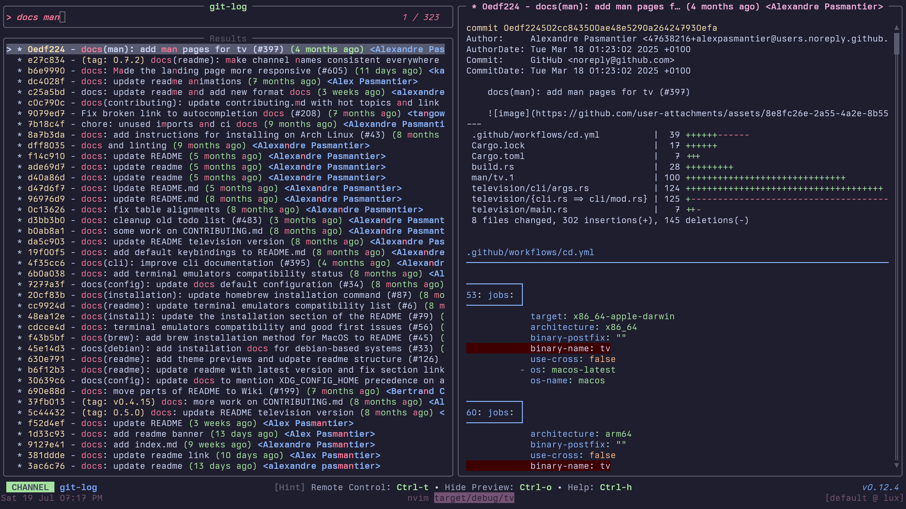

# Contributing new channels

***NOTE**: for general setup information before contributing, see [Contributing](../developers/contributing.md).*

Contributing a new channel is as you might expect, pretty straightforward.

1. Create a new branch, add and commit your new channel's TOML file under `cable/unix` (or `cable/windows` depending on your usecase).
2. [OPTIONAL] Add a screenshot of the channel in `assets/channels/<os>/` (e.g. `assets/channels/unix/my_channel.png`). The file name must match the channel's `metadata.name`, otherwise the docs generator won't pick it up. A screenshot placed directly in `assets/channels/` is used as a fallback for all platforms.
3. Push your commit and create a PR.
4. The ci should automatically generate the documentation for your channel and pick up the screenshot if available.
5. If 4. fails, you can generate the docs manually by running:
    ```sh
    just generate-cable-docs
    ```


### Examples
#### git-log

```toml
[metadata]
name = "git-log"
description = "A channel to select from git log entries"
requirements = ["git"]

[source]
command = "git log --pretty=format:'%C(yellow)%h%Creset -%C(yellow)%d%Creset %s %Cgreen(%cr) %C(bold blue)<%an>%Creset' --abbrev-commit --color=always"
output = "{strip_ansi|split: :0}"
ansi = true
no_sort = true
frecency = false

[preview]
command = "git show -p --stat --pretty=fuller --color=always '{strip_ansi|split: :0}' | head -n 1000"

[keybindings]
ctrl-y = "actions:cherry-pick"
ctrl-r = "actions:revert"
ctrl-o = "actions:checkout"

[actions.cherry-pick]
description = "Cherry-pick the selected commit"
command = "git cherry-pick '{strip_ansi|split: :0}'"
mode = "execute"

[actions.revert]
description = "Revert the selected commit"
command = "git revert '{strip_ansi|split: :0}'"
mode = "execute"

[actions.checkout]
description = "Checkout the selected commit"
command = "git checkout '{strip_ansi|split: :0}'"
mode = "execute"
```

