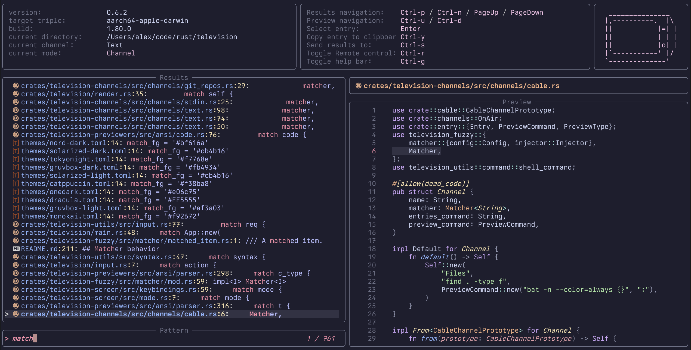

# Themes
Builtin themes are available in the [themes](https://github.com/alexpasmantier/television/tree/main/themes) directory. Feel free to experiment and maybe even contribute your own!

|           catppuccin           |  gruvbox-dark |
| :--------------------------------------------------------------------------------: | :------------------------------------------------------: |
|  **solarized-dark** |        **nord**        |

You may create your own custom themes by adding them to the `themes` directory in your configuration folder and then referring to them by file name (without the extension) in the configuration file.
```
config_location/
├── themes/
│   └── my_theme.toml
└── config.toml
```

*my_theme.toml*
```toml
# general
background = '#1e1e2e'
border_fg = '#6c7086'
text_fg = '#cdd6f4'
dimmed_text_fg = '#6c7086'
# input
input_text_fg = '#f38ba8'
result_count_fg = '#f38ba8'
# results
result_name_fg = '#89b4fa'
result_line_number_fg = '#f9e2af'
result_value_fg = '#b4befe'
selection_fg = '#a6e3a1'
selection_bg = '#313244'
match_fg = '#f38ba8'
# preview
preview_title_fg = '#fab387'
# modes
channel_mode_fg = '#1e1e2e'
channel_mode_bg = '#f5c2e7'
remote_control_mode_fg = '#1e1e2e'
remote_control_mode_bg = '#a6e3a1'
send_to_channel_mode_fg = '#89dceb'
```